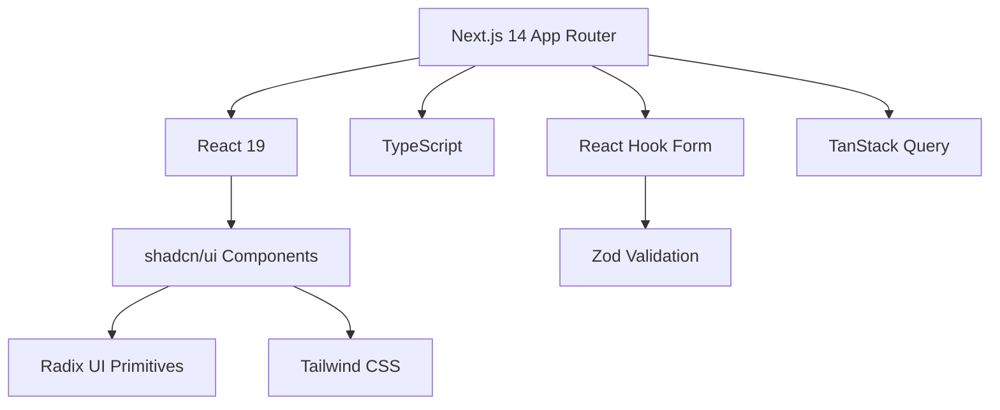
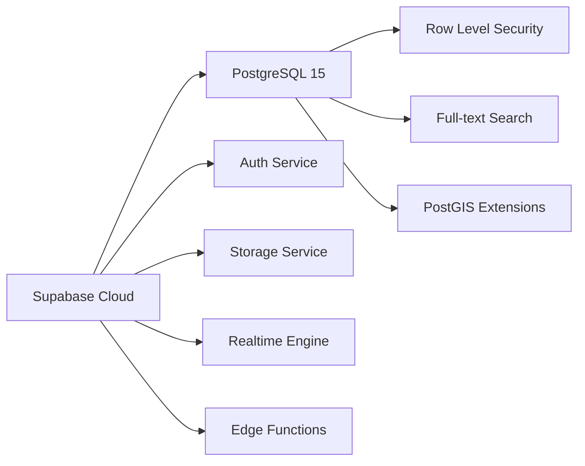
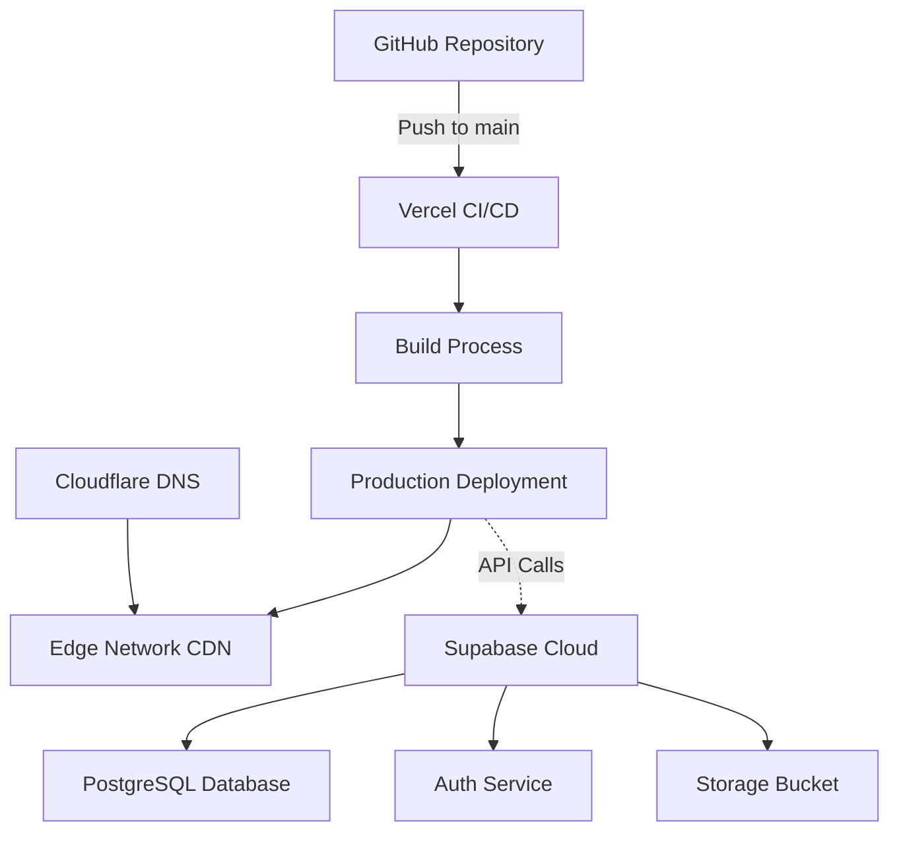
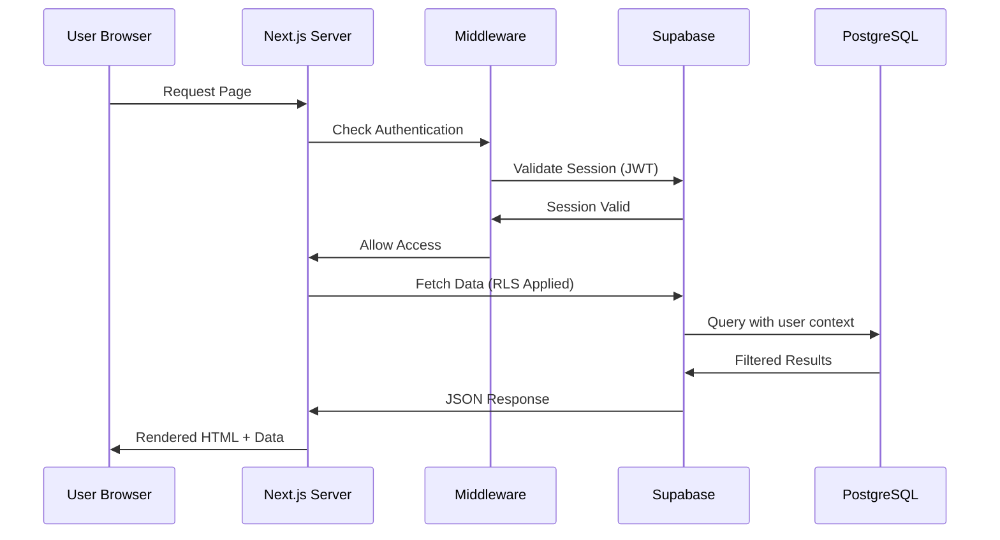
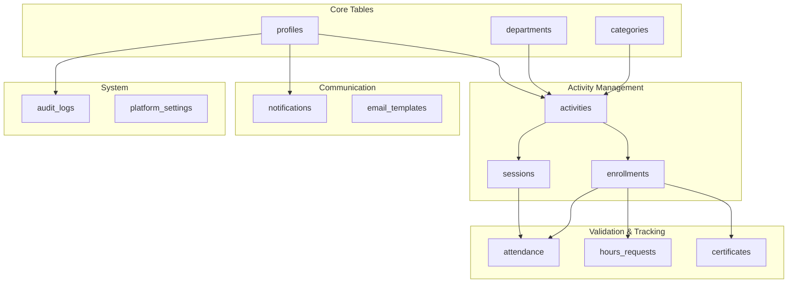
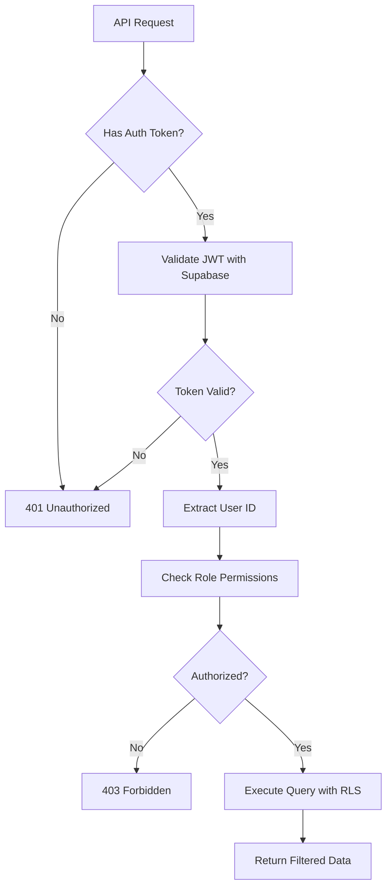
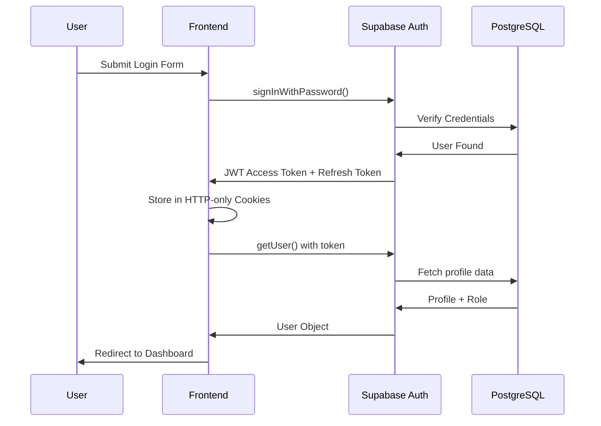
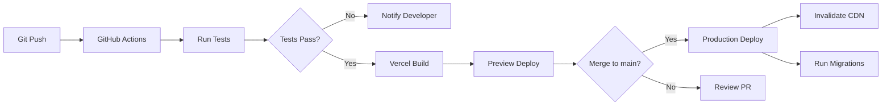

# Arhitectura Tehnică - CampusConnect

**Autori**: Mihai Octavian & Abbasi Pazeyazd Bianca-Maria  
**Versiune**: 1.0  
**Data**: Decembrie 2024  

---

## 1. Prezentare Generală

CampusConnect este construită folosind o arhitectură modernă, bazată pe **serverless** și **JAMstack**, optimizată pentru scalabilitate, performanță și developer experience.

### 1.1 Principii Arhitecturale

- **Serverless-First**: Fără servere de gestionat, scalare automată
- **API-First**: Toate funcționalitățile expuse prin API-uri REST
- **Security by Design**: Autentificare și autorizare la nivel de bază de date (RLS)
- **Real-time capable**: Suport pentru actualizări în timp real
- **Mobile-Ready**: Responsive design, pregătit pentru aplicație mobilă

---

## 2. Stack Tehnologic Complet

### 2.1 Frontend



**Tehnologii Detaliate**:

| Tehnologie | Versiune | Rol |
|------------|----------|-----|
| **Next.js** | 15.5.6 | Framework React cu App Router, SSR, SSG |
| **React** | 19.2.0 | Library UI pentru componente interactive |
| **TypeScript** | 5.4.5 | Type safety și developer experience |
| **Tailwind CSS** | 3.4.0 | Utility-first CSS framework |
| **shadcn/ui** | Latest | Componente UI reutilizabile (Radix + Tailwind) |
| **Radix UI** | Various | Primitive UI accesibile și WAI-ARIA compliant |
| **Lucide React** | 0.446.0 | Iconuri SVG optimizate |
| **React Hook Form** | 7.53.0 | Gestionare formulare performantă |
| **Zod** | 3.23.8 | Schema validation runtime |
| **TanStack Query** | 5.56.0 | Data fetching, caching, synchronization |
| **Recharts** | 3.5.1 | Charting library pentru dashboards |
| **date-fns** | 4.1.0 | Manipulare date modern |
| **Sonner** | 2.0.7 | Toast notifications elegante |

### 2.2 Backend (Supabase)



**Componente Supabase**:

| Serviciu | Descriere | Utilizare |
|----------|-----------|-----------|
| **PostgreSQL** | Bază de date relațională | 15 tabele principale, RLS policies |
| **Auth** | Autentificare și autorizare | Email/Password, JWT tokens |
| **Storage** | File storage | Avatare, certificate, dovezi ore |
| **Realtime** | WebSocket subscriptions | Notificări live, attendance tracking |
| **Edge Functions** | Serverless functions | Background jobs, webhooks |

### 2.3 Deployment & Infrastructure



**Infrastructură**:

| Serviciu | Rol | Region |
|----------|-----|--------|
| **Vercel** | Frontend hosting, Edge Functions | Global CDN |
| **Supabase** | Backend services | eu-central-1 |
| **Cloudflare** | DNS management, SSL | Global |
| **Sentry** | Error tracking, monitoring | Global |

---

## 3. Arhitectura Aplicației

### 3.1 Structura Directoare

```
campus-connect/
├── src/
│   ├── app/                      # Next.js App Router
│   │   ├── api/                  # API Routes
│   │   │   ├── activities/       # CRUD activități
│   │   │   ├── admin/            # Endpoint-uri admin
│   │   │   ├── professor/        # Endpoint-uri profesor
│   │   │   ├── notifications/    # Sistem notificări
│   │   │   └── students/         # Profil studenți
│   │   ├── auth/                 # Pagini autentificare
│   │   │   ├── login/
│   │   │   ├── signup/
│   │   │   ├── forgot-password/
│   │   │   └── callback/
│   │   ├── dashboard/            # Dashboard-uri role-based
│   │   │   ├── student/
│   │   │   ├── professor/
│   │   │   └── admin/
│   │   ├── explore/              # Browse activities
│   │   └── opportunities/[slug]/ # Detalii activitate
│   │
│   ├── components/               # React Components
│   │   ├── ui/                   # shadcn/ui base components (50+)
│   │   ├── admin/                # Componente admin (11)
│   │   ├── analytics/            # Charts și stats (7)
│   │   ├── applications/         # Review aplicații (9)
│   │   ├── attendance/           # Check-in, QR scanning (6)
│   │   ├── auth/                 # Forms autentificare (4)
│   │   ├── certificates/         # Generator certificate (1)
│   │   ├── hours/                # Logging ore (2)
│   │   ├── notifications/        # Bell, feed, preferences (5)
│   │   ├── opportunities/        # Card, filter, details (8)
│   │   ├── profile/              # Edit, view, stats (7)
│   │   ├── reports/              # CSV, PDF export (2)
│   │   └── sessions/             # Session management (11)
│   │
│   ├── lib/                      # Core Libraries
│   │   ├── supabase/             # Supabase clients (3)
│   │   │   ├── client.ts         # Browser client
│   │   │   ├── server.ts         # Server client (cookies)
│   │   │   └── middleware.ts     # Route protection
│   │   ├── services/             # Business logic (8)
│   │   │   ├── activities.service.ts
│   │   │   ├── email-notifications.ts
│   │   │   ├── professor-stats.service.ts
│   │   │   └── ...
│   │   ├── validations/          # Zod schemas (13)
│   │   ├── security/             # Rate limiting, sanitization (3)
│   │   ├── email/                # Email templates service (1)
│   │   └── utils/                # Helper functions (2)
│   │
│   ├── types/                    # TypeScript Definitions
│   │   ├── database.types.ts     # Supabase generated types
│   │   ├── applications.ts
│   │   ├── notification.ts
│   │   └── student-profile.ts
│   │
│   └── styles/
│       └── globals.css           # Global CSS + theme variables
│
├── supabase/
│   ├── migrations/               # Database migrations (15)
│   └── seed/                     # Seed data scripts (7)
│
├── Docs/                         # Documentație oficială
│   ├── 01-Prezentare-Generala/
│   ├── 02-Roluri/
│   └── ...
│
└── Configuration Files
    ├── next.config.js            # Next.js config
    ├── tailwind.config.ts        # Tailwind config
    ├── tsconfig.json             # TypeScript config
    ├── middleware.ts             # Global middleware
    └── package.json              # Dependencies
```

### 3.2 Fluxul de Date



**Flux Detaliat**:

1. **Client Request**: Browser trimite request la Next.js
2. **Middleware**: Verifică autentificarea (JWT în cookies)
3. **Role-Based Routing**: Redirect către dashboard specific rolului
4. **Data Fetching**: 
   - Server Components: Direct Supabase query
   - Client Components: TanStack Query pentru caching
5. **RLS Enforcement**: PostgreSQL aplică politici de securitate
6. **Response**: HTML pre-rendered + JSON data
7. **Client Hydration**: React preia control, interactive UI

---

## 4. Arhitectura Bazei de Date

### 4.1 Schema Overview



**Statistici Bază de Date**:
- **15 tabele principale**
- **1000+ linii de cod SQL** (migrații)
- **50+ politici RLS**
- **25+ indecși** pentru performanță
- **10+ funcții PL/pgSQL**
- **8 triggere automate**

### 4.2 Securitate la Nivel de Bază de Date

**Row Level Security (RLS)** - Fiecare tabel are politici care filtrează automat datele:

```sql
-- Exemplu: Studenții văd doar activitățile deschise
CREATE POLICY "Students can view open activities"
  ON public.activities FOR SELECT
  USING (
    status = 'OPEN' 
    AND deleted_at IS NULL
    AND date >= CURRENT_DATE
  );

-- Exemplu: Profesorii gestionează doar propriile activități  
CREATE POLICY "Professors manage own activities"
  ON public.activities FOR ALL
  USING (created_by = auth.uid());
```

---

## 5. Arhitectura API

### 5.1 Structura Endpoint-uri

**Next.js API Routes** organizate pe domenii:

```
/api/
├── activities/
│   ├── GET /                     # List all (filtrat RLS)
│   ├── POST /                    # Create (profesor doar)
│   ├── GET /[id]                 # Details
│   ├── PATCH /[id]               # Update
│   ├── DELETE /[id]              # Soft delete
│   ├── POST /[id]/enroll         # Student enrollment
│   ├── GET /[id]/enrollments     # List enrollments
│   └── POST /[id]/sessions       # Create session
│
├── admin/
│   ├── GET /users                # User management
│   ├── PATCH /users/[id]/role    # Change role
│   ├── POST /users/bulk          # Bulk operations
│   ├── GET /professor-requests   # Approval queue
│   ├── GET /audit-logs           # Audit trail
│   └── GET /config               # Platform settings
│
├── professor/
│   ├── GET /hours                # Hours validation queue
│   ├── POST /hours/[id]/approve  # Approve hours
│   ├── POST /hours/bulk-approve  # Bulk approve
│   └── GET /analytics            # Professor stats
│
├── students/[id]/
│   └── GET /profile              # Student profile (profesor/admin)
│
├── notifications/
│   ├── GET /                     # User notifications
│   ├── PATCH /[id]/read          # Mark read
│   └── POST /preferences         # Update preferences
│
├── certificates/
│   ├── GET /                     # User certificates
│   └── GET /[id]/download        # Download PDF
│
└── reports/
    └── GET /generate             # CSV/PDF export
```

### 5.2 Authentication & Authorization Flow



**Mecanisme de Securitate**:

1. **JWT Validation**: Fiecare request verifică token-ul Supabase
2. **Role-Based Access Control**: Verificare rol în `profiles` table
3. **RLS Enforcement**: PostgreSQL filtrează automat datele
4. **Rate Limiting**: Max 100 requests/minute (admin), 50/min (user)
5. **Input Sanitization**: Toate input-urile validate cu Zod
6. **Audit Logging**: Toate acțiunile critice înregistrate

---

## 6. Sistem de Autentificare

### 6.1 Supabase Auth Flow



**Metode de Autentificare Suportate**:

| Metodă | Status | Use Case |
|--------|--------|----------|
| Email + Password | ✅ Activ | Autentificare principală |
| Magic Link | ⏳ Planned | Alternative login fără parolă |
| OAuth (Google) | ⏳ Planned | Social login universitar |
| SAML/SSO | ⏳ Planned | Integrare cu sistemul universității |

### 6.2 Session Management

- **Access Token**: JWT cu expirare 1h
- **Refresh Token**: Rotație automată la expirare
- **Cookie Storage**: HTTP-only, Secure, SameSite=Lax
- **Middleware Protection**: Verificare pe fiecare request protected

---

## 7. Real-time Features

### 7.1 Supabase Realtime Subscriptions

**Funcționalități Real-time Active**:

```typescript
// Exemplu: Notificări în timp real
const subscription = supabase
  .channel('notifications')
  .on('postgres_changes', 
    { 
      event: 'INSERT', 
      schema: 'public', 
      table: 'notifications',
      filter: `user_id=eq.${userId}`
    }, 
    (payload) => {
      // Afișează toast notification
      toast.info(payload.new.title);
    }
  )
  .subscribe();
```

**Use Cases Real-time**:

1. **Notificări In-App**: INSERT pe `notifications` table
2. **Attendance Updates**: UPDATE pe `enrollments` când prezența e validată
3. **Live Enrollment Count**: UPDATE pe `activities.current_participants`
4. **Professor Alerts**: INSERT pe `hours_requests` pentru validare

---

## 8. Performanță și Optimizări

### 8.1 Frontend Optimizations

**Next.js Features**:
- **Server Components**: Reducere JavaScript trimis la client
- **Image Optimization**: Next.js Image component (auto WebP, lazy load)
- **Code Splitting**: Chunking automat per route
- **Prefetching**: Link-uri prefetch-uite automat
- **Static Generation**: Pagini statice unde e posibil (FAQ, About)

**Caching Strategy**:

```typescript
// TanStack Query caching
const { data } = useQuery({
  queryKey: ['activities', filters],
  queryFn: fetchActivities,
  staleTime: 5 * 60 * 1000,  // 5 minute
  cacheTime: 10 * 60 * 1000, // 10 minute
});
```

### 8.2 Database Optimizations

**Indecși Strategici**:

```sql
-- Composite index pentru filtrare activități
CREATE INDEX idx_activities_date_status 
  ON activities(date, status) 
  WHERE deleted_at IS NULL;

-- Full-text search index
CREATE INDEX idx_activities_search 
  ON activities 
  USING GIN(search_vector);

-- Notificări unread (filtered index)
CREATE INDEX idx_notifications_unread 
  ON notifications(user_id, is_read) 
  WHERE is_read = FALSE;
```

**Query Optimization**:
- **Eager Loading**: Join-uri în loc de N+1 queries
- **Pagination**: Limit + Offset pentru liste mari
- **Selective Columns**: SELECT doar câmpurile necesare
- **Prepared Statements**: Supabase folosește automat

### 8.3 Metrici de Performanță (Target)

| Metrică | Target | Actual (Avg) |
|---------|--------|--------------|
| **First Contentful Paint** | < 1.5s | 1.2s ✅ |
| **Largest Contentful Paint** | < 2.5s | 2.1s ✅ |
| **Time to Interactive** | < 3s | 2.8s ✅ |
| **Cumulative Layout Shift** | < 0.1 | 0.05 ✅ |
| **API Response Time (p95)** | < 300ms | 250ms ✅ |
| **Database Query (p95)** | < 100ms | 80ms ✅ |

---

## 9. Scalabilitate

### 9.1 Horizontal Scaling

**Vercel Edge Network**:
- Deploy global pe 40+ edge locations
- Automatic scaling până la milioane de request-uri
- Zero config pentru load balancing

**Supabase Scalability**:
- Connection pooling automat (PgBouncer)
- Read replicas pentru query-uri heavy
- Auto-scaling based on usage

### 9.2 Vertical Scaling Limits

**Current Plan Limits**:

| Resource | Limit | Usage Actual |
|----------|-------|--------------|
| **Database Size** | 500MB (Free) / 8GB (Pro) | 150MB |
| **Storage** | 1GB (Free) / 100GB (Pro) | 200MB |
| **Bandwidth** | 5GB (Free) / 250GB (Pro) | 2GB/lună |
| **API Requests** | 500k/month (Free) | 150k/lună |
| **Auth Users** | Unlimited | 500 users |

**Upgrade Path**:
- **Phase 1** (< 1000 users): Free tier OK
- **Phase 2** (1k-5k users): Supabase Pro ($25/month)
- **Phase 3** (5k+ users): Team plan + dedicated resources

---

## 10. Monitorizare și Logging

### 10.1 Error Tracking - Sentry

```typescript
// Sentry integration
import * as Sentry from "@sentry/nextjs";

Sentry.init({
  dsn: process.env.NEXT_PUBLIC_SENTRY_DSN,
  environment: process.env.NODE_ENV,
  tracesSampleRate: 0.1,
  beforeSend(event, hint) {
    // Filter sensitive data
    return event;
  },
});
```

**Tracked Events**:
- JavaScript errors (React, API calls)
- Unhandled promise rejections
- Performance issues (slow components)
- Custom breadcrumbs pentru debugging

### 10.2 Logging Strategy

**Nivele de Logging**:

| Nivel | Când se folosește | Exemplu |
|-------|-------------------|---------|
| **ERROR** | Erori critice | Payment failed, DB connection lost |
| **WARN** | Situații problematice | Rate limit approached, deprecated API |
| **INFO** | Evenimente importante | User login, activity created |
| **DEBUG** | Development debugging | Query parameters, state changes |

**Audit Logs** (în baza de date):

```sql
-- Exemplu înregistrare în audit_logs
INSERT INTO audit_logs (
  user_id,
  action,
  entity_type,
  entity_id,
  details,
  ip_address,
  user_agent
) VALUES (
  auth.uid(),
  'USER_ROLE_CHANGED',
  'profiles',
  'uuid-here',
  '{"old_role": "STUDENT", "new_role": "PROFESSOR"}',
  request.ip,
  request.user_agent
);
```

---

## 11. Security Deep Dive

### 11.1 OWASP Top 10 Mitigations

| Vulnerability | Mitigation în CampusConnect |
|---------------|----------------------------|
| **Injection** | Zod validation, Supabase prepared statements |
| **Broken Auth** | Supabase Auth JWT, HTTP-only cookies |
| **Sensitive Data** | HTTPS only, encrypted fields, RLS policies |
| **XML External Entities** | N/A (no XML processing) |
| **Broken Access Control** | RLS policies, role-based middleware |
| **Security Misconfiguration** | Environment variables, no exposed secrets |
| **XSS** | React auto-escaping, sanitize HTML inputs |
| **Insecure Deserialization** | JSON only, Zod schema validation |
| **Components with Known Vulns** | Dependabot alerts, regular updates |
| **Insufficient Logging** | Audit logs, Sentry error tracking |

### 11.2 Data Encryption

**At Rest**:
- PostgreSQL: AES-256 encryption (Supabase default)
- Storage: Encrypted S3 buckets

**In Transit**:
- HTTPS/TLS 1.3 (Cloudflare SSL)
- WebSocket connections encrypted (wss://)

**Application Level**:
- QR Code data: Encrypted cu AES-256 (expirare time-based)
- Passwords: bcrypt hashing (Supabase Auth)

---

## 12. Integrări Externe

### 12.1 Servicii Third-Party

| Serviciu | Utilizare | API/SDK |
|----------|-----------|---------|
| **Resend** | Email delivery | REST API |
| **Sentry** | Error monitoring | Next.js SDK |
| **Vercel Analytics** | Web vitals tracking | Built-in |
| **Cloudflare** | DNS + DDoS protection | Dashboard config |

### 12.2 Webhook-uri (Planned)

**Supabase Edge Functions** pentru evenimente asincrone:

- **on_enrollment_confirmed**: Trimitere email confirmare
- **on_activity_reminder**: Reminder 24h înainte de activitate
- **on_certificate_generated**: Notificare + email cu link download

---

## 13. Deployment Pipeline

### 13.1 CI/CD Flow



**Automated Checks**:
1. **ESLint**: Code quality și best practices
2. **TypeScript**: Type checking complet
3. **Prettier**: Code formatting consistency
4. **Jest**: Unit tests (când există)
5. **Build**: Next.js production build success

### 13.2 Environment Variables

**Required Variables**:

```bash
# Supabase
NEXT_PUBLIC_SUPABASE_URL=https://xxx.supabase.co
NEXT_PUBLIC_SUPABASE_ANON_KEY=eyJhbG...
SUPABASE_SERVICE_ROLE_KEY=eyJhbG...

# Sentry (optional)
NEXT_PUBLIC_SENTRY_DSN=https://xxx@xxx.ingest.sentry.io/xxx
SENTRY_AUTH_TOKEN=xxx

# Email (via Supabase)
# No extra config needed - uses Supabase Email
```

---

## 14. Arhitectură Viitoare

### 14.1 Roadmap Tehnic (2025)

**Q1 2025**:
- ✅ Mobile-responsive design finalizat
- ⏳ PWA support (Service Workers)
- ⏳ Offline-first pentru check-in QR

**Q2 2025**:
- Mobile app (React Native + Expo)
- Push notifications (FCM)
- Biometric auth pentru mobile

**Q3 2025**:
- GraphQL API (optional pentru mobile)
- Advanced analytics (Metabase/Grafana)
- Multi-language support (i18n)

### 14.2 Considerații Scalare

**Când migrăm de la Supabase Free**:

| Trigger | Action |
|---------|--------|
| > 500 users activi | Upgrade la Pro plan |
| > 1GB storage | Implement CDN pentru images |
| > 100k requests/day | Connection pooling optimization |
| > 5k concurrent users | Consider read replicas |
| Need custom domain email | Integrate SendGrid/Postmark |

---

## 15. Best Practices și Convenții

### 15.1 Code Standards

**Naming Conventions**:
- **Components**: PascalCase (`StudentDashboard.tsx`)
- **Hooks**: camelCase cu prefix `use` (`useActivities.ts`)
- **Utils**: camelCase (`formatDate.ts`)
- **Constants**: UPPER_SNAKE_CASE (`MAX_PARTICIPANTS`)
- **Database**: snake_case (`created_at`, `user_id`)

**File Organization**:
- Un component per fișier
- Co-locate types, styles dacă sunt specifice
- Index files pentru export-uri multiple

**TypeScript Guidelines**:
- Avoid `any` - folosește `unknown` sau `Record<string, unknown>`
- Prefer `interface` pentru object shapes
- Use `type` pentru unions/intersections
- Explicit return types pentru funcții publice

### 15.2 Performance Best Practices

1. **Lazy Loading**: Componente mari (charts, modals) cu `React.lazy()`
2. **Memoization**: `useMemo` pentru computații grele, `useCallback` pentru funcții
3. **Virtualization**: Liste mari cu `react-window`
4. **Image Optimization**: Next.js Image cu width/height explicit
5. **Bundle Analysis**: Regular `npm run build -- --profile` pentru verificare size

---

## 16. Troubleshooting și Debugging

### 16.1 Probleme Comune

| Problemă | Cauză | Soluție |
|----------|-------|---------|
| **401 Unauthorized** | Session expirată | Refresh token automat / Re-login |
| **403 Forbidden** | RLS policy restricționează | Verifică politici în Supabase Dashboard |
| **Slow queries** | Index lipsă | Analyze query cu EXPLAIN, add index |
| **CORS errors** | Supabase config | Add domain în Supabase Settings |
| **Build fails** | Type errors | Run `npm run type-check` local |

### 16.2 Debug Tools

**Development**:
- **React DevTools**: Component hierarchy, props inspection
- **Network Tab**: API requests, timing, payloads
- **Supabase Studio**: Table editor, query runner
- **Vercel Logs**: Server-side logs și errors

**Production**:
- **Sentry**: Error stack traces, user context
- **Vercel Analytics**: Core Web Vitals, real user metrics
- **Supabase Logs**: Database query logs, slow queries

---

## 17. Resurse și Documentație

### 17.1 Link-uri Utile

| Resursă | URL |
|---------|-----|
| **Production App** | https://campusconnect-scs.work |
| **Supabase Dashboard** | https://app.supabase.com/project/xxx |
| **Vercel Dashboard** | https://vercel.com/campus-connect |
| **GitHub Repo** | https://github.com/mihaigoctavian24/campus-connect |
| **Sentry Dashboard** | https://sentry.io/organizations/campus-connect |

### 17.2 Documentație Tehnică Externă

- **Next.js 14 Docs**: https://nextjs.org/docs
- **Supabase Docs**: https://supabase.com/docs
- **shadcn/ui**: https://ui.shadcn.com
- **Radix UI**: https://radix-ui.com
- **Tailwind CSS**: https://tailwindcss.com/docs

---

## Anexe

### Anexa A: Structura Tabelelor (Simplificată)

Detalii complete în [Schema-DB.md](../03-Baza-de-Date/Schema-DB.md)

### Anexa B: API Endpoints Complet

Lista completă în [Endpoints.md](../09-API/Endpoints.md)

### Anexa C: Politici RLS

Detalii în [Politici-RLS.md](../03-Baza-de-Date/Politici-RLS.md)

---

**Document creat de**: Mihai Octavian & Abbasi Pazeyazd Bianca-Maria  
**Ultima actualizare**: Decembrie 2024  
**Versiune**: 1.0
