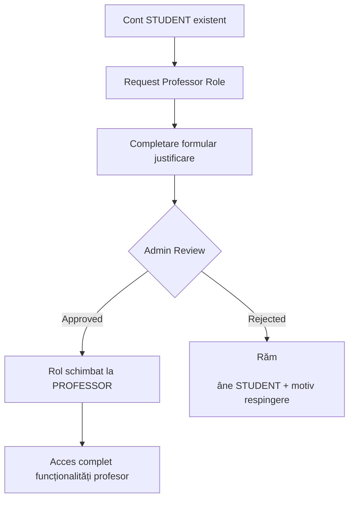
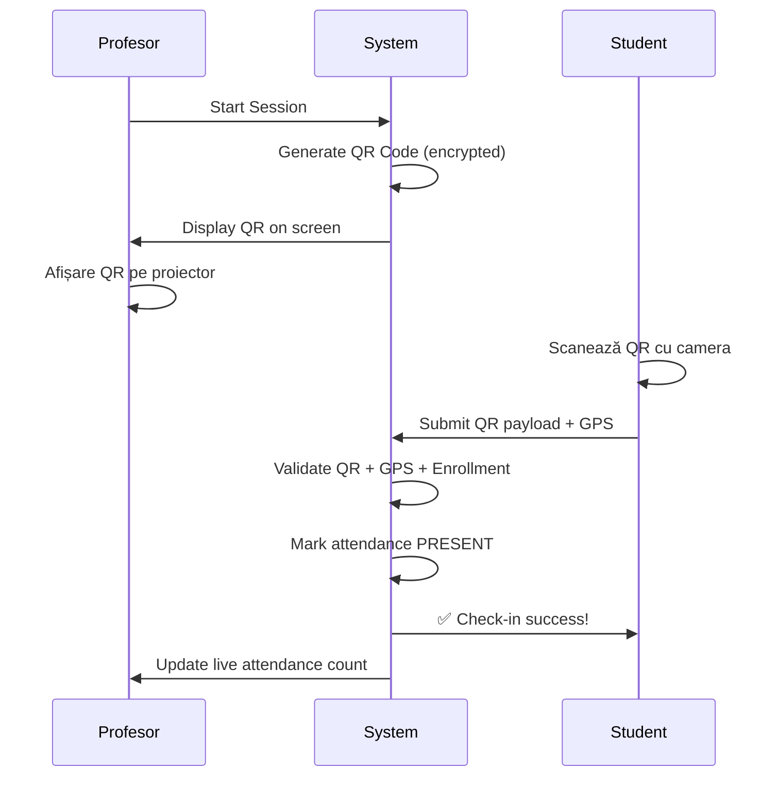

# Rol: Profesor

**Autori**: Mihai Octavian & Abbasi Pazeyazd Bianca-Maria  
**Versiune**: 1.0  
**Data**: Decembrie 2024  

---

## Prezentare Generală

Rolul de **Profesor** reprezintă utilizatorul coordonator și organizator al activităților de voluntariat în platformă CampusConnect. Profesorii au capabilități extinse de management al activităților, validare participare studenți și raportare.

**Responsabilități Principale**:
- Creare și management activități de voluntariat
- Aprobare/Respingere aplicații studenți
- Validare prezență (QR code, manual, bulk)
- Aprobare ore externe solicitate de studenți
- Generare rapoarte și analytics
- Comunicare cu studenții înscriși

---

## Obținerea Rolului de Profesor

### Proces de Aprobare



**Cerințe Pentru Aprobare**:
1. ✅ Email universitar verificat
2. ✅ Motivație clară (min 100 caractere)
3. ✅ Specificare departament afiliere
4. ✅ Documente suport (opțional): contract, legitimație
5. ✅ Aprobare de la administrator platformă

**Formular Request**:
- **Departament**: Dropdown cu departamente active
- **Motivație**: Textarea - De ce vrei să devii profesor coordonator?
- **Documente**: Upload opțional (PDF, max 5MB)

---

## Funcționalități Principale

### 1. 📋 Creare Activități

#### 1.1 Wizard Multi-Step

**Step 1: Basic Information**

| Câmp | Descriere | Validare |
|------|-----------|----------|
| **Titlu** | Nume activitate | Min 10, max 200 caractere |
| **Descriere** | Detalii complete | Min 100, max 5000 caractere, suportă Markdown |
| **Categorie** | Tipul activității | Select din: Academic Support, Community Service, Event Assistance, Mentorship, Research, Technical |
| **Departament** | Organizator | Dropdown departamente (auto-populat cu al profesorului) |
| **Imagine** | Vizual reprezentativ | URL sau upload, opțional, 16:9 ratio recomandat |

**Step 2: Logistics**

| Câmp | Descriere | Validare |
|------|-----------|----------|
| **Locație** | Adresa desfășurare | Min 5 caractere, sugestii Google Maps (planned) |
| **Tip Locație** | On-Campus / Remote / Hybrid | Select |
| **Dată** | Dată începere | >= Azi, format: DD/MM/YYYY |
| **Ora Început** | Start activitate | Format: HH:MM (24h) |
| **Ora Sfârșit** | End activitate | > Ora Început |
| **Capacitate** | Max participanți | 1-500, default: 20 |
| **Criterii Eligibilitate** | Cerințe speciale | Opțional, max 500 caractere |

**Step 3: Review & Publish**

- Preview complet activitate
- Verificare toate câmpurile
- Opțiuni:
  - **Publish Now**: Status = OPEN, vizibilă imediat
  - **Save as Draft**: Status = DRAFT, invizibilă pentru studenți (planned)
  - **Schedule**: Publicare automată la dată specifică (planned)

#### 1.2 Activități Recurente

**Use Case**: Mentorship program cu sesiuni săptămânale

```mermaid
graph LR
    A[Create Activity] --> B[Add Sessions Tab]
    B --> C[Click "Add Recurring Sessions"]
    C --> D[Pattern: Weekly]
    D --> E[Select days: Mon, Wed, Fri]
    E --> F[Start date + End date]
    F --> G[Auto-generate 12 sessions]
    G --> H[Each session: QR code independent]
```

**Patterns Suportate**:
- **Daily**: Zilnic pentru perioada specificată
- **Weekly**: Selectează zilele săptămânii (ex: Luni, Miercuri)
- **Bi-weekly**: La 2 săptămâni
- **Monthly**: O dată pe lună (aceeași zi)
- **Custom**: Manual adaugă fiecare sesiune

---

### 2. 👥 Management Înscrieri

#### 2.1 Dashboard Enrollments

**View Modes**:

1. **Table View** (default):
   - Coloane: Student, Email, Data Înscriere, Status, Actions
   - Sortare: Dată, Nume, Status
   - Filtre: Status (CONFIRMED, WAITLISTED, CANCELLED)

2. **Card View**:
   - Card per student cu poză profil
   - Quick stats: Total ore, Activități completate
   - Quick actions: Approve, Reject, View Profile

**Status Enrollment**:
- 🟢 **CONFIRMED**: Înscris și confirmat, contorizat în `current_participants`
- 🔵 **WAITLISTED**: Pe listă așteptare, peste capacitate
- 🔴 **CANCELLED**: Anulat de student sau profesor
- 🟡 **PENDING**: În așteptare aprobare (planned pentru activități selective)

#### 2.2 Student Profile Quick View

**Click pe nume student** → Modal cu:

**Informații Personale**:
- Nume complet, email, telefon
- Poză profil
- Facultate, Specializare, An studiu
- GPA (dacă completat)

**Statistici Voluntariat**:
- 📊 Total ore acumulate: `X hours`
- ✅ Activități completate: `Y activities`
- ⭐ Rating mediu primit: `4.8/5`
- 🏆 Badge-uri câștigate: Lista badge-uri

**Istoric Participare**:
- Lista ultimele 5 activități
- Pentru fiecare: Titlu, Dată, Ore, Status

**Actions**:
- ✉️ Send Message (planned)
- 📧 Send Email (deschide client email)
- 🚫 Ban from Future Activities (planned pentru abuse)

#### 2.3 Comunicare Bulk

**Select multiple students** → Actions:
- **Send Notification**: Mesaj personalizat în platformă
- **Send Email**: Template sau custom HTML
- **Export List**: CSV cu date studenți (pentru evidență)

---

### 3. ✓ Validare Prezență

#### 3.1 Metoda 1: QR Code (Recomandat)



**Generare QR Code**:

1. **Navigate**: Activity Details → Sessions Tab
2. **Click**: "Start Session" pe sesiunea activă
3. **Auto-generate**: QR code cu encrypted payload:
   ```json
   {
     "session_id": "uuid-here",
     "timestamp": 1638360000,
     "expires_at": "2024-12-31T18:00:00Z",
     "signature": "encrypted-hash"
   }
   ```
4. **Display**: QR fullscreen mode (recomandatpe proiector)
5. **Monitor**: Live feed cu studenții care au făcut check-in
6. **Expirare**: Automată la `session.end_time`

**Security Features**:
- 🔒 AES-256 encryption
- ⏱️ Time-limited (expiră la sfârșitul sesiunii)
- 📍 GPS validation (±15m de locația declarată)
- 🚫 One-time use per student

#### 3.2 Metoda 2: Marcare Manuală

**Use Case**: Activitate outdoor fără internet stabil

**Process**:
1. **Navigate**: Activity → Attendance Tab
2. **View**: Lista studenți CONFIRMED
3. **Check-in**: Toggle switch pentru fiecare student
   - ✅ PRESENT (verde)
   - ❌ ABSENT (roșu)
   - 🟡 EXCUSED (galben - cu motiv)
   - ⏰ LATE (portocaliu - cu minute întârziere)
4. **Bulk Actions**:
   - "Mark All Present": Toți studenți PRESENT
   - "Import from List": Upload CSV cu nume studenți
5. **Save**: Salvare automată la toggle

**Attendance Notes**:
- Câmp text opțional per student
- Ex: "Plecat mai devreme pentru examen", "Ajuns cu 15 min întârziere"

#### 3.3 Metoda 3: Bulk Upload

**Use Case**: Activitate mare (50+ studenți), listă semnături hârtie

**Upload CSV Format**:
```csv
email,status,notes
maria.popescu@univ.ro,PRESENT,
ion.ionescu@univ.ro,LATE,15 min întârziere
ana.pop@univ.ro,EXCUSED,Certificat medical
```

**Process**:
1. **Download Template**: CSV pre-populat cu studenți înscriși
2. **Fill Offline**: Adaugă status + notes
3. **Upload**: Drag-and-drop sau file picker
4. **Validate**: System verifică email-uri exists
5. **Preview**: Tabel cu modificările propuse
6. **Confirm**: Apply bulk attendance

---

### 4. ⏱️ Validare Ore Externe

#### 4.1 Queue de Cereri

**Dashboard View**: Tab "Hours Validation"

| Prioritate | Sortare |
|------------|---------|
| 🔴 **Urgent** | > 7 zile în așteptare |
| 🟡 **Normal** | 3-7 zile |
| 🟢 **Recent** | < 3 zile |

**Filtre**:
- Status: PENDING / APPROVED / REJECTED / ALL
- Student: Search by name sau email
- Date range: Custom range picker
- Ore solicitate: Min-max slider

#### 4.2 Review Process

**Click pe cerere** → Detailed View:

**Student Info** (stânga):
- Nume, poză profil
- Total ore până acum
- Istoric cereri (câte aprobate/respinse)

**Request Details** (dreapta):
- **Activitate**: Titlu activitate externă
- **Dată**: Când a avut loc
- **Ore solicitate**: Number (1-24)
- **Descriere**: Text detaliat despre ce a făcut
- **Dovezi**: Thumbnails imagini/PDF-uri uploaded
  - Click pentru preview fullscreen
  - Download pentru verificare offline

**Actions**:

✅ **Approve**:
- Optional: Add professor notes (ex: "Verificat cu organizatorul ONG")
- Ore se adaugă automat la total student
- Notificare + email trimis la student
- Dacă total ore completează activitate → Auto-generare certificat

❌ **Reject**:
- **Motiv obligatoriu**: Textarea, min 20 caractere
- Exemple:
  - "Dovezile nu sunt clare - te rugăm să uploadezi imagini mai detaliate"
  - "Activitatea nu se încadrează în criteriile departamentului"
  - "Descrierea nu corespunde cu dovezile prezentate"
- Notificare + email cu motiv trimis la student
- Student poate re-submite cerere cu dovezi îmbunătățite

⏸️ **Request More Info** (planned):
- Mesaj către student cu ce informații lipsesc
- Status = PENDING_INFO
- Notificare student să completeze

#### 4.3 Bulk Approval

**Use Case**: 20 studenți participă la același event extern

**Process**:
1. **Select Multiple**: Checkboxes pe cereri similare
2. **Bulk Approve**: Buton "Approve Selected (15)"
3. **Add Common Notes**: "Verified with NGO coordinator - all confirmed"
4. **Confirm**: Dialog cu preview
5. **Execute**: Toate cererile aprobate simultan
6. **Notifications**: Toate trimise în batch

**Safeguards**:
- Max 50 requests per bulk action
- Confirmation dialog cu preview
- Audit log entry pentru fiecare aprobare

---

### 5. 📊 Analytics și Raportare

#### 5.1 Dashboard Professor

**Stats Cards** (top):

| Metric | Descriere | Formula |
|--------|-----------|---------|
| **Active Opportunities** | Activități OPEN create de tine | `COUNT WHERE status=OPEN AND created_by=prof_id` |
| **Total Students** | Studenți unici înscriși la activitățile tale | `COUNT DISTINCT user_id FROM enrollments` |
| **Pending Actions** | Cereri + aplicații în așteptare | `enrollments.PENDING + hours.PENDING` |
| **Total Hours Awarded** | Ore totale acordate studenților | `SUM(hours) WHERE approved_by=prof_id` |

**Charts**:

1. **Enrollments Over Time** (Line Chart):
   - X-axis: Săptămâni (last 12 weeks)
   - Y-axis: Number of enrollments
   - Multiple series: Per categorie activitate

2. **Attendance Rate** (Gauge Chart):
   - Formula: `(PRESENT / TOTAL_ENROLLED) * 100`
   - Color coding:
     - 🟢 > 80%: Excellent
     - 🟡 60-80%: Good
     - 🔴 < 60%: Needs improvement

3. **Category Breakdown** (Pie Chart):
   - Distribution ore acordate per categorie
   - Hover: Show number + percentage

#### 5.2 Activity-Level Analytics

**Per activitate**: Tab "Analytics"

**Participation Metrics**:
- **Enrollment Rate**: Înscriși / Capacitate
- **Attendance Rate**: Prezenți / Înscriși
- **Completion Rate**: Finalizat activitate / Înscriși
- **Average Rating**: Dacă feedback activat

**Student Demographics**:
- **By Faculty**: Pie chart
- **By Year**: Bar chart (An 1, An 2, etc)
- **By GPA Range**: Histogram (planned)

**Time Series**:
- **Enrollments**: Când s-au înscris (spike analysis)
- **Check-ins**: Distribuție ore check-in (identify late comers)

#### 5.3 Export Rapoarte

**Report Types**:

1. **Student Hours Report**:
   - Pentru: Evidență departament, raportări oficiale
   - Format: CSV / Excel / PDF
   - Columns: Nume, Email, Activitate, Ore, Dată, Status
   - Filtre: Date range, Activitate specifică

2. **Activity Summary Report**:
   - Pentru: Board meetings, funding applications
   - Includes: Titlu, Participanți, Ore totale, Feedback mediu
   - Charts: Embedded în PDF

3. **Attendance Report**:
   - Pentru: Verificare prezență instituțională
   - Columns: Student, Check-in Time, Method (QR/Manual), GPS coords
   - Certified: Semnătură digitală profesor (planned)

**Export Flow**:
```mermaid
graph LR
    A[Click "Generate Report"] --> B[Select Type]
    B --> C[Configure Filters]
    C --> D[Preview Data]
    D --> E{Format?}
    E -->|CSV| F[Download CSV]
    E -->|PDF| G[Generate PDF]
    G --> H[Download PDF]
    F --> I[Open în Excel]
```

---

### 6. 📧 Comunicare cu Studenți

#### 6.1 Notificări Automate

**Triggered Notifications** (sistem trimite automat):

| Event | Recipients | Message |
|-------|-----------|---------|
| **Activity Created** | Studenți cu preferințe matching category | "Activitate nouă: {title}" |
| **Enrollment Confirmed** | Student specific | "Înscrierea ta la {activity} a fost confirmată" |
| **Session Reminder 24h** | Studenți înscriși | "Reminder: {activity} mâine la {time}" |
| **Session Reminder 1h** | Studenți înscriși | "{activity} începe în 1 oră!" |
| **Activity Updated** | Studenți înscriși | "Modificări la {activity}: {changes}" |
| **Activity Cancelled** | Studenți înscriși | "ANULATĂ: {activity} - {reason}" |

#### 6.2 Mesaje Custom

**Compose Message**: Button în Enrollments list

**Template Variables** (auto-populate):
- `{{student_name}}`: Nume student
- `{{activity_title}}`: Titlu activitate
- `{{session_date}}`: Dată sesiune
- `{{location}}`: Locație
- `{{your_name}}`: Nume profesor

**Example Message**:
```
Bună {{student_name}},

Mulțumesc pentru înscrierea la {{activity_title}}! 

Sesiunea va avea loc pe {{session_date}} la {{location}}.

Te rugăm să ajungi cu 10 minute înainte pentru check-in.

Cu respect,
{{your_name}}
```

**Send Options**:
- ✉️ **In-App Notification**: Instant delivery
- 📧 **Email**: Via Supabase Email Service
- 📱 **Both**: Notification + Email

---

### 7. 🎓 Certificare Studenți

#### 7.1 Auto-Generate După Completare

**Trigger**: Student completează activitate + prezență validată

```mermaid
graph TD
    A[Attendance validated] --> B{All sessions complete?}
    B -->|No| C[Wait for more sessions]
    B -->|Yes| D[Check hours approved]
    D --> E{Hours >= required?}
    E -->|No| F[Student must log more hours]
    E -->|Yes| G[Auto-generate certificate]
    G --> H[Upload PDF la Storage]
    H --> I[INSERT în certificates table]
    I --> J[Notify student: "Certificat disponibil!"]
```

**Certificate Template** (PDF):
- Header: Logo universitate
- Titlu: "Certificat de Participare"
- Content:
  ```
  Se atestă că [NUME STUDENT]
  a participat la activitatea de voluntariat
  "[TITLU ACTIVITATE]"
  
  organizată de [DEPARTAMENT]
  în perioada [DATĂ ÎNCEPERE] - [DATĂ SFÂRȘIT]
  
  acumulând un total de [X] ore de voluntariat.
  ```
- Semnături: Profesor coordonator + Admin (digital signatures)
- Footer: QR code verificare + Număr unic certificat
- Watermark: "Campus Connect - Official Certificate"

#### 7.2 Manual Override (planned)

**Use Case**: Student a participat parțial dar merită certificat

**Process**:
1. Navigate: Activity → Students Tab
2. Select: Student specific
3. Click: "Issue Certificate Manually"
4. Specify: Ore custom (poate fi mai puțin decât totalul)
5. Add Note: Justificare (ex: "Participare exceptională deși lipsă 1 sesiune")
6. Generate: Certificat cu mențiune "Issued by Professor Override"

---

### 8. ⚙️ Setări Profesor

#### 8.1 Notification Preferences

**Customize ce notificări primești**:

| Event | Email | In-App | Disabled |
|-------|-------|--------|----------|
| New Enrollment | ✅ | ✅ | ❌ |
| Hours Request | ✅ | ✅ | ❌ |
| Student Cancelled | ❌ | ✅ | ❌ |
| Session Approaching | ✅ | ❌ | ❌ |
| Feedback Received | ❌ | ✅ | ❌ |

**Digest Mode** (planned):
- Daily digest: 1 email/zi cu toate notificările
- Weekly digest: Summary săptămânal
- Real-time: Notificări instant (default)

#### 8.2 Default Settings

**Auto-apply la activități noi**:
- **Default Department**: Pre-select departament
- **Default Capacity**: 20 participants
- **Auto-approve Enrollments**: ON/OFF
- **Require Motivation**: Studenți trebuie să completeze câmp "De ce vrei să participi?"
- **Enable Feedback**: Activat feedback post-activitate

---

## Restricții și Limitări

### Ce NU poate face un Profesor?

❌ **Nu poate vedea/edita activități ale altui profesor** - Doar propriile activități  
❌ **Nu poate schimba roluri utilizatori** - Doar admin poate  
❌ **Nu poate șterge studenți din platformă** - Doar remove din activitate  
❌ **Nu poate accesa audit logs complete** - Doar propriile acțiuni (planned)  
❌ **Nu poate modifica departamente/categorii** - Doar admin poate  
❌ **Nu poate aproba cereri profesor** - Doar admin poate  

### Limite Rate

| Acțiune | Limit | Interval |
|---------|-------|----------|
| Create Activities | 10 | 1 oră |
| Bulk Approve Hours | 50 requests | 1 batch |
| Send Mass Notifications | 100 recipients | 1 mesaj |
| Export Reports | 5 | 1 oră |

---

## Best Practices pentru Profesori

### 🎯 Creare Activități Eficiente

1. **Titlu Descriptiv**: "STEM Mentorship pentru Anul 1" > "Mentorship"
2. **Descriere Detaliată**:
   - Ce vor face studenții (tasks)
   - Ce vor învăța (learning outcomes)
   - Ce trebuie să aducă (materials needed)
3. **Criterii Clare**: Specifică an studiu, facultate, skills necesare
4. **Capacitate Realistă**: Nu supraestima - mai bine multiple sesiuni
5. **Imagine Reprezentativă**: Crește rata de înscriere cu 40%

### ⏱️ Management Timp Eficient

1. **Use Recurring Sessions**: Pentru programe lungi
2. **QR Code Pentru Grupuri Mari**: Mai rapid decât manual (1 min vs 10 min pentru 50 studenți)
3. **Bulk Actions**: Aprobare ore în batch
4. **Templates Mesaje**: Salvează mesaje folosite frecvent (planned)

### 📊 Maximizare Participare

**Timing Perfect**:
- Publică activități cu 2-3 săptămâni înainte
- Reminder 24h înainte → +15% attendance rate
- Sesiuni de dimineață (9-12) → cel mai mare show-up rate

**Communication**:
- Update studenții cu 48h înainte despre modificări
- Thank you message post-activitate → crește loyalty
- Share results/impact → motivează participări viitoare

### 🔍 Quality Control

**Pre-Activity**:
- Review profile studenți înscriși
- Contactează studenți cu întrebări prin platformă
- Pregătește materials în avans

**During Activity**:
- Check-in în primele 15 minute
- Monitor attendance live feed
- Note observații pentru feedback

**Post-Activity**:
- Process hours în max 48h
- Request feedback de la studenți
- Review analytics pentru improvement

---

## FAQ Profesori

**Î: Pot crea activități pentru alte departamente?**  
R: Nu, doar pentru departamentul tău afiliat. Dacă vrei colaborare inter-departamente, contactează admin.

**Î: Ce se întâmplă dacă un student lipsește o sesiune dintr-o serie?**  
R: Poți marca ABSENT pentru acea sesiune. Studentul primește ore doar pentru sesiunile prezent.

**Î: Pot șterge o activitate după ce studenți s-au înscris?**  
R: Da, dar e soft delete. Studenții primesc notificare de anulare. Consideră "Cancel" în loc de "Delete" pentru transparență.

**Î: Cum gestionez waiting list?**  
R: Când un student confirmat anulează, sistem promovează automat primul de pe waiting list și îl notifică.

**Î: Pot exporta lista studenți pentru evidență offline?**  
R: Da, CSV export disponibil în tab-ul Enrollments. Include toate datele necesare pentru raportare.

**Î: QR code funcționează offline?**  
R: Nu, atât generarea cât și scanarea necesită internet. Pentru activități fără net, folosește marcare manuală.

**Î: Ce fac dacă un student pretinde că a scanat QR dar nu apare în sistem?**  
R: Verifică în Attendance History dacă există tentativă failed (GPS, QR expirat, etc). Poți marca manual prezent cu note explicative.

**Î: Pot delega validarea orelor unui asistent?**  
R: Nu direct, dar asistentul poate cere rol PROFESSOR pentru propriile activități. Pentru activitățile tale, doar tu poți aproba.

---

**Document creat de**: Mihai Octavian & Abbasi Pazeyazd Bianca-Maria  
**Ultima actualizare**: Decembrie 2024  
**Versiune**: 1.0
