# Fluxuri Utilizatori - CampusConnect

**Autori**: Mihai Octavian & Abbasi Pazeyazd Bianca-Maria  
**Versiune**: 1.0  
**Data**: Decembrie 2024  

---

## 1. Introducere

Acest document descrie fluxurile principale ale utilizatorilor prin platforma CampusConnect, acoperind toate cele 3 roluri (Student, Profesor, Administrator) și scenariile lor de utilizare tipice.

---

## 2. Fluxuri Autentificare

### 2.1 Înregistrare Utilizator Nou

```mermaid
graph TD
    A[Vizitare /auth/signup] --> B[Completare formular]
    B --> C{Validare date}
    C -->|Invalid| D[Afișare erori]
    D --> B
    C -->|Valid| E[Supabase Auth: Create User]
    E --> F{Success?}
    F -->|No| G[Eroare: Email deja folosit]
    G --> B
    F -->|Yes| H[Creare profil în DB]
    H --> I[Trimitere email verificare]
    I --> J[Redirect la /auth/verify-email]
    J --> K[User verifică emailul]
    K --> L[Click link verificare]
    L --> M[Redirect la /dashboard/student]
    M --> N[Completare profil obligatoriu]
```



**Pași Detaliali**:

1. **Acces formular** `/auth/signup`
2. **Input**:
   - Email universitar (validare format `.edu.ro` sau domeniul universității)
   - Parolă (min 8 caractere, 1 majusculă, 1 număr)
   - Nume
   - Prenume
   - Facultate
   - An studiu
3. **Validare client-side** (Zod schema)
4. **Trimitere request** la `/api/auth/signup`
5. **Server**:
   - Creare cont Supabase Auth
   - INSERT în `profiles` table cu rol `STUDENT` default
   - Trimitere email verificare
6. **Email verificare**:
   - Link magic cu token JWT
   - Expirare 24h
7. **Confirmare** → Redirect la dashboard
8. **Complete Profile**: Adăugare telefon, poză profil (opțional)

### 2.2 Login Utilizator Existent

```mermaid
graph TD
    A[Vizitare /auth/login] --> B[Introducere email + parolă]
    B --> C[Submit formular]
    C --> D[Supabase Auth: signInWithPassword]
    D --> E{Credentials OK?}
    E -->|No| F[Eroare: Email sau parolă greșită]
    F --> B
    E -->|Yes| G{Email verificat?}
    G -->|No| H[Redirect la /auth/verify-email]
    H --> I[Retrimitere email verificare]
    G -->|Yes| J[Setare JWT în cookies]
    J --> K[Fetch user profile + role]
    K --> L{Rol utilizator?}
    L -->|STUDENT| M[Redirect /dashboard/student]
    L -->|PROFESSOR| N[Redirect /dashboard/professor]
    L -->|ADMIN| O[Redirect /dashboard/admin]
```



**Flow Detaliat**:

1. **Acces** `/auth/login`
2. **Completare**: Email + Parolă
3. **Submit** → API call la Supabase
4. **Validare**:
   - Verificare email exists
   - Bcrypt compare password hash
5. **Dacă success**:
   - Generare JWT access token (exp: 1h)
   - Generare refresh token (exp: 7 zile)
   - Stocare în HTTP-only cookies
6. **Fetch profile**:
   ```sql
   SELECT id, email, role, first_name, last_name 
   FROM profiles 
   WHERE id = auth.uid()
   ```
7. **Middleware** verifică rol → redirect la dashboard corespunzător

### 2.3 Reset Parolă

```mermaid
graph LR
    A[Click "Forgot Password?"] --> B[/auth/forgot-password]
    B --> C[Introduce email]
    C --> D[Submit]
    D --> E[Supabase: resetPasswordForEmail]
    E --> F[Email trimis cu link reset]
    F --> G[User click link]
    G --> H[/auth/reset-password?token=xxx]
    H --> I[Introduce parolă nouă]
    I --> J[Supabase: updateUser]
    J --> K[Parolă actualizată]
    K --> L[Auto-login + redirect dashboard]
```

---

## 3. Fluxuri Student

### 3.1 Descoperire și Înscriere la Activitate

```mermaid
sequenceDiagram
    participant S as Student
    participant F as Frontend
    participant API as API Route
    participant DB as Supabase DB

    S->>F: Vizitare /explore
    F->>API: GET /api/activities?status=OPEN
    API->>DB: Query cu RLS (doar OPEN + viitoare)
    DB->>API: Lista activități
    API->>F: JSON response
    F->>S: Afișare card-uri activități

    S->>F: Aplică filtre (categorie, dată)
    F->>API: GET /api/activities?category=X&date=Y
    API->>DB: Filtered query
    DB->>API: Rezultate filtrate
    API->>F: Updated lista
    F->>S: Re-render card-uri

    S->>F: Click "View Details" pe activitate
    F->>S: Afișare modal cu detalii complete
    
    S->>F: Click "Enroll Now"
    F->>API: POST /api/activities/{id}/enroll
    API->>DB: Verificare locuri disponibile
    DB->>API: Spots available
    API->>DB: INSERT în enrollments
    API->>DB: INSERT notification pentru student
    API->>DB: UPDATE current_participants++
    DB->>API: Success
    API->>F: Enrollment confirmed
    F->>S: Toast + redirect la "My Activities"
```



**Detalii Validare Înscriere**:

```typescript
// Backend validation
if (activity.current_participants >= activity.max_participants) {
  // Adaugă pe waiting list
  status = 'WAITLISTED';
} else {
  status = 'CONFIRMED';
  activity.current_participants++;
}

// Verificare conflict orar
const conflicts = await checkScheduleConflict(userId, activityDate);
if (conflicts.length > 0) {
  return { error: 'Ești deja înscris la o activitate în acest interval' };
}
```

### 3.2 Check-in la Activitate (QR Code)

```mermaid
sequenceDiagram
    participant P as Profesor
    participant S as Student
    participant APP as App (Mobile/Web)
    participant API as Backend
    participant DB as Database

    Note over P: Activitatea începe
    P->>API: POST /api/sessions/{id}/generate-qr
    API->>DB: Generate encrypted QR payload
    Note over API: Payload: {session_id, timestamp, signature}
    API->>DB: Store qr_code_data + expires_at
    DB->>API: QR saved
    API->>P: QR Code image (base64)
    P->>P: Afișare QR pe proiector

    Note over S: Student ajunge la locație
    S->>APP: Deschide camera QR scanner
    APP->>APP: Scanează QR code
    APP->>API: POST /api/attendance/check-in
    Note over API: Include: qr_payload + GPS coords
    
    API->>API: Decrypt QR payload
    API->>API: Verificare expirare (< session end time)
    API->>API: Validare GPS (±15m de locație)
    
    API->>DB: Verificare enrollment exists
    DB->>API: Enrollment found
    
    API->>DB: INSERT în attendance table
    DB->>API: Attendance recorded
    
    API->>DB: UPDATE enrollments SET attendance_status='PRESENT'
    API->>DB: INSERT notification "Attendance confirmed"
    
    API->>APP: {success: true, hours_credited: 3}
    APP->>S: ✅ Prezență confirmată! +3 ore
```



**QR Code Encryption**:

```typescript
// Generate QR
const payload = {
  session_id: sessionId,
  timestamp: Date.now(),
  expires_at: sessionEndTime,
};

const encrypted = AES.encrypt(
  JSON.stringify(payload),
  process.env.QR_SECRET_KEY
).toString();

// QR Code conține: encrypted string
```

**Validări la Check-in**:

1. ✅ QR code valid și decriptabil
2. ✅ QR nu e expirat (< session end time)
3. ✅ Student înscris la activitate
4. ✅ Nu a mai făcut check-in deja
5. ✅ GPS location matching (±15m) - opțional
6. ✅ Session status = 'IN_PROGRESS'

### 3.3 Logging Ore Externe

```mermaid
graph TD
    A[Student Dashboard] --> B[Click "Log Hours"]
    B --> C[Completare formular]
    C --> D[Upload dovezi: poze, PDF]
    D --> E[Submit cerere]
    E --> F[API: POST /api/hours/log]
    F --> G[Validare Zod schema]
    G --> H{Valid?}
    H -->|No| I[Return errors]
    I --> C
    H -->|Yes| J[Upload files la Supabase Storage]
    J --> K[INSERT în hours_requests]
    K --> L[Notificare profesor coordonator]
    L --> M[Status: PENDING]
    M --> N[Afișare în dashboard student]
    
    O[Profesor Review] --> P{Decizie}
    P -->|Approve| Q[UPDATE status=APPROVED]
    Q --> R[Adăugare ore la total student]
    R --> S[Notificare + email student]
    
    P -->|Reject| T[UPDATE status=REJECTED]
    T --> U[Add rejection_reason]
    U --> V[Notificare + email student]
```

**Formular Logging Ore**:

| Câmp | Tip | Validare | Obligatoriu |
|------|-----|----------|-------------|
| **Activitate** | Text | Min 10 caractere | ✅ |
| **Ore** | Number | 1-24 ore | ✅ |
| **Dată** | Date | Max azi, min 6 luni în trecut | ✅ |
| **Descriere** | Textarea | Min 50 caractere | ✅ |
| **Dovezi** | Files | Max 10 files, 5MB each, jpg/png/pdf | ✅ |

**Backend Processing**:

```typescript
// Upload dovezi
const uploadedUrls = await Promise.all(
  files.map(file => 
    supabase.storage
      .from('hours-evidence')
      .upload(`${userId}/${Date.now()}_${file.name}`, file)
  )
);

// Create hours request
await supabase.from('hours_requests').insert({
  user_id: userId,
  activity_id: null, // External activity
  hours: data.hours,
  date: data.date,
  description: data.description,
  evidence_urls: uploadedUrls.map(u => u.data.path),
  status: 'PENDING',
});

// Notify professor
await createNotification({
  user_id: coordinatorId,
  type: 'HOURS_REQUEST',
  title: 'Cerere ore nouă',
  message: `${student.name} a solicitat ${data.hours}h`,
});
```

### 3.4 Vizualizare Certificate

```mermaid
graph LR
    A[Dashboard Student] --> B[Navigate to "Certificates"]
    B --> C[API: GET /api/certificates]
    C --> D[Query certificates table]
    D --> E[Filter by user_id cu RLS]
    E --> F[Return lista certificate]
    F --> G[Afișare card-uri certificate]
    
    H[Click "Download PDF"] --> I[API: GET /api/certificates/{id}/download]
    I --> J[Fetch certificate_url din Storage]
    J --> K[Generate signed URL 60s expiry]
    K --> L[Return download link]
    L --> M[Browser download PDF]
```

**Certificat PDF Conținut**:

- Header: Logo universitate + "Campus Connect"
- Titlu: "Certificat de Participare"
- Detalii:
  - Nume complet student
  - Titlu activitate
  - Data desfășurare
  - Număr ore voluntariat
  - Semnături digitale (profesor + admin)
- Footer:
  - Număr unic certificat (UUID)
  - QR code pentru verificare autenticitate
  - Data emiterii

---

## 4. Fluxuri Profesor

### 4.1 Creare Activitate

```mermaid
graph TD
    A[Dashboard Profesor] --> B[Click "Create Opportunity"]
    B --> C[Wizard Step 1: Basic Info]
    C --> D[Titlu, Descriere, Categorie]
    D --> E[Upload imagine reprezentativă]
    E --> F[Next: Step 2]
    
    F --> G[Logistics: Locație, Dată, Oră]
    G --> H[Capacitate maximă participanți]
    H --> I[Criterii eligibilitate - opțional]
    I --> J[Next: Step 3]
    
    J --> K[Review: Previzualizare completă]
    K --> L[Submit: POST /api/activities]
    
    L --> M[Validare Zod schema]
    M --> N{Valid?}
    N -->|No| O[Afișare erori specific pe câmp]
    O --> C
    
    N -->|Yes| P[Verificare rol PROFESSOR]
    P --> Q[INSERT în activities table]
    Q --> R[Activitate creată cu status=OPEN]
    R --> S[Notificare studenți interesați]
    S --> T[Redirect la Activity Details]
```

**Validation Rules**:

```typescript
const activitySchema = z.object({
  title: z.string().min(10).max(200),
  description: z.string().min(100).max(5000),
  category_id: z.string().uuid(),
  department_id: z.string().uuid(),
  date: z.string().refine(d => new Date(d) >= new Date()),
  start_time: z.string().regex(/^([01]\d|2[0-3]):([0-5]\d)$/),
  end_time: z.string().regex(/^([01]\d|2[0-3]):([0-5]\d)$/),
  location: z.string().min(5).max(200),
  max_participants: z.number().min(1).max(500),
  eligibility_criteria: z.string().max(500).optional(),
  image_url: z.string().url().nullable(),
}).refine(data => data.end_time > data.start_time, {
  message: "End time must be after start time",
});
```

### 4.2 Review Aplicații Studenți

```mermaid
sequenceDiagram
    participant S as Student
    participant DB as Database
    participant P as Profesor
    participant N as Notifications

    S->>DB: Enrollment request (auto-confirm)
    DB->>N: Notify profesor "New enrollment"
    
    P->>DB: GET /api/activities/{id}/enrollments
    DB->>P: Lista enrollments (CONFIRMED)
    
    Note over P: Review student profiles
    P->>P: Click pe student name
    P->>DB: GET /api/students/{id}/profile
    DB->>P: Student details + stats
    
    alt Aprobare (already confirmed)
        P->>P: Student rămâne CONFIRMED
    else Respingere
        P->>DB: PATCH /api/enrollments/{id}/reject
        DB->>DB: UPDATE status=CANCELLED
        DB->>DB: Add rejection_reason
        DB->>N: Notify student cu motiv
    end
    
    Note over P: Dacă waiting list exists
    P->>DB: Aprobare student waitlisted
    DB->>DB: UPDATE status=CONFIRMED
    DB->>DB: current_participants++
    DB->>N: Notify student "Ești acum confirmat!"
```



**Student Profile Quick View**:

- Nume complet, email, telefon
- Facultate, an studiu, GPA
- Total ore voluntariat acumulate
- Activități completate (listă)
- Rating mediu primit
- Badge-uri câștigate

### 4.3 Management Sesiuni și QR Code

```mermaid
graph TD
    A[Activitate Details Page] --> B[Tab "Sessions"]
    B --> C[Click "Add Session"]
    C --> D[Formular: Dată, Oră, Locație]
    D --> E{Recurent?}
    E -->|Nu| F[Create single session]
    E -->|Da| G[Pattern: Weekly/Daily]
    G --> H[End date recurență]
    H --> I[Generate multiple sessions]
    
    F --> J[Sessions list]
    I --> J
    
    K[Zi activitate] --> L[Click "Start Session"]
    L --> M[UPDATE session status=IN_PROGRESS]
    M --> N[Generate QR Code]
    N --> O[Encrypt payload cu AES-256]
    O --> P[Display QR pe ecran]
    P --> Q[Studenți scanează QR]
    
    R[Session end time] --> S[Click "End Session"]
    S --> T[UPDATE status=COMPLETED]
    T --> U[QR code expiră automat]
    U --> V[Generare automată certificate]
```

**Recurring Sessions Example**:

- **Pattern**: Weekly (săptămânal)
- **Days**: Monday, Wednesday (selectabil)
- **Start**: 2025-01-10
- **End**: 2025-03-01
- **Result**: 16 sesiuni create automat

### 4.4 Validare Ore Externe

```mermaid
graph LR
    A[Dashboard Profesor] --> B[Tab "Hours Validation"]
    B --> C[Lista PENDING requests]
    C --> D[Click pe cerere]
    D --> E[View detalii]
    E --> F[Student info]
    E --> G[Activitate + ore solicitate]
    E --> H[Descriere detaliată]
    E --> I[Dovezi uploaded: preview]
    
    I --> J{Decizie}
    J -->|Approve| K[Add optional notes]
    K --> L[POST /api/hours/approve]
    L --> M[UPDATE status=APPROVED]
    M --> N[Ore adăugate la total student]
    N --> O[Notificare + email student]
    O --> P{Toate orele completate?}
    P -->|Yes| Q[Auto-generare certificat]
    
    J -->|Reject| R[Rejection reason OBLIGATORIU]
    R --> S[POST /api/hours/reject]
    S --> T[UPDATE status=REJECTED]
    T --> U[Notificare + email cu motiv]
    
    V[Bulk Actions] --> W[Select multiple requests]
    W --> X[Bulk Approve / Bulk Reject]
```

**Profesor Notes Examples**:

✅ **Approve**:
- "Verificat cu coordonatorul ONG-ului partener - confirmed"
- "Dovezi clare, activitate validă"
- "Conform criteriilor departamentului"

❌ **Reject**:
- "Dovezile nu sunt clare - te rugăm să uploadezi poze mai bune"
- "Activitatea nu se încadrează în categoria voluntariat academic"
- "Descrierea nu corespunde cu dovezile prezentate"

---

## 5. Fluxuri Administrator

### 5.1 Aprobare Cereri Rol Profesor

```mermaid
graph TD
    A[User Sign-up cu rol STUDENT] --> B[Request Professor Role]
    B --> C[Completare formular justificare]
    C --> D[Departament, Motiv, Documente]
    D --> E[Submit: POST /api/professor-requests]
    E --> F[INSERT în professor_role_requests]
    F --> G[Status: PENDING]
    
    H[Admin Dashboard] --> I[Notification "New professor request"]
    I --> J[Navigate to "Professor Approval Queue"]
    J --> K[Lista cereri PENDING]
    K --> L[Click pe cerere pentru review]
    
    L --> M[View: User profile]
    L --> N[View: Justificare detaliată]
    L --> O[View: Documente suport]
    
    P{Admin decizie} -->|Approve| Q[UPDATE role='PROFESSOR']
    Q --> R[UPDATE request status=APPROVED]
    R --> S[Notificare user + email]
    S --> T[User are acces profesor features]
    
    P -->|Reject| U[Add rejection_reason]
    U --> V[UPDATE request status=REJECTED]
    V --> W[Notificare + email cu motiv]
    W --> X[User rămâne STUDENT]
```

**Criterii Aprobare Profesor**:

1. ✅ Email universitar verificat (`.edu.ro` sau domeniu oficial)
2. ✅ Justificare clară și detaliată (min 100 caractere)
3. ✅ Departament valid din universitate
4. ✅ Documente suport (opțional): contract muncă, legitimație profesor
5. ✅ Nu are istoric de abuse sau penalități

### 5.2 Bulk User Management

```mermaid
graph LR
    A[Admin Users Page] --> B[Table cu toți utilizatorii]
    B --> C[Filtre: Rol, Status, Facultate]
    C --> D[Select multiple users checkboxes]
    D --> E[Bulk Actions Menu]
    
    E --> F{Acțiune}
    F -->|Change Role| G[Select new role: STUDENT/PROFESSOR/ADMIN]
    G --> H[Confirm dialog]
    H --> I[POST /api/admin/users/bulk]
    I --> J[Update role pentru toți selected]
    J --> K[Audit log entry]
    
    F -->|Deactivate| L[Confirm "Deactivate X users?"]
    L --> M[UPDATE is_active=false]
    M --> N[Users nu se mai pot loga]
    N --> K
```

**Safeguards Bulk Actions**:

- ❌ Nu poți face bulk action pe propriul cont admin
- ⚠️ Confirmation dialog pentru acțiuni distructive
- 📝 Toate acțiunile loggate în `audit_logs`
- 🔒 Rate limit: max 5 bulk operations / minut

### 5.3 Management Categorii și Departamente

```mermaid
graph TD
    A[Admin Settings] --> B[Tab "Categories & Departments"]
    
    B --> C[Categories Section]
    C --> D[Create Category]
    D --> E[Nume, Descriere, Icon, Color]
    E --> F[Submit: POST /api/categories]
    F --> G[INSERT nou category]
    G --> H[Available pentru activities]
    
    B --> I[Departments Section]
    I --> J[Create Department]
    J --> K[Nume, Short Code, Contact]
    K --> L[Upload logo departament]
    L --> M[Submit: POST /api/departments]
    M --> N[INSERT departament nou]
    N --> O[Profesori pot crea activities pt dept]
```

**Categories Default** (seeded în DB):

| Categorie | Icon | Color | Descriere |
|-----------|------|-------|-----------|
| **Academic Support** | 📚 | Blue | Tutoriat, meditiații, workshop-uri |
| **Community Service** | 🤝 | Green | Voluntariat comunitate, proiecte sociale |
| **Event Assistance** | 🎉 | Purple | Organizare evenimente, conferințe |
| **Mentorship** | 👨‍🏫 | Orange | Mentorat studenți, ghidare carieră |
| **Research** | 🔬 | Red | Asistență cercetare, proiecte R&D |
| **Technical** | 💻 | Cyan | Support IT, dezvoltare software |

### 5.4 Audit Logs și Monitorizare


**Tracked Actions în Audit Log**:

| Action | Entity | Logged When |
|--------|--------|-------------|
| **USER_LOGIN** | auth | La fiecare login success |
| **USER_LOGOUT** | auth | La logout explicit |
| **ROLE_CHANGED** | profiles | Admin schimbă rolul |
| **ACTIVITY_CREATED** | activities | Profesor creează activitate |
| **ACTIVITY_DELETED** | activities | Soft delete activitate |
| **ENROLLMENT_CANCELLED** | enrollments | Student/profesor anulează |
| **HOURS_APPROVED** | hours_requests | Profesor aprobă ore |
| **CONFIG_UPDATED** | platform_settings | Admin modifică settings |

---

## 6. Fluxuri Notificări

### 6.1 Sistem Notificări In-App


**Notification Types**:

| Type | Trigger | Recipients |
|------|---------|------------|
| **ENROLLMENT_CONFIRMED** | Student înregistrare | Student |
| **ACTIVITY_UPDATED** | Profesor editează | Studenți înscriși |
| **ACTIVITY_CANCELLED** | Profesor anulează | Studenți înscriși |
| **SESSION_REMINDER** | 24h înainte | Studenți înscriși |
| **ATTENDANCE_VALIDATED** | Profesor validează | Student |
| **HOURS_APPROVED** | Profesor aprobă ore | Student |
| **HOURS_REJECTED** | Profesor respinge | Student |
| **CERTIFICATE_READY** | Auto-generate | Student |
| **NEW_ENROLLMENT** | Student se înscrie | Profesor |
| **PROFESSOR_REQUEST** | User cere rol | Admini |

### 6.2 Email Notifications Flow

```mermaid
graph TD
    A[Event occurs] --> B[Create in-app notification]
    B --> C{User preferences: Email ON?}
    C -->|No| D[Skip email]
    C -->|Yes| E[Fetch email template]
    E --> F[Populate variables]
    F --> G{Template type}
    G -->|System| H[Default template]
    G -->|Custom| I[Department template]
    
    H --> J[Render HTML email]
    I --> J
    J --> K[Supabase Email Service]
    K --> L[Queue email în background]
    L --> M[Send via SMTP]
    M --> N{Success?}
    N -->|Yes| O[UPDATE email_sent=true]
    N -->|No| P[Retry 3 times]
    P --> Q[Log error în Sentry]
```



**Email Template Variables**:

```typescript
// Exemplu: ENROLLMENT_CONFIRMED
{
  studentName: "Maria Popescu",
  activityTitle: "STEM Mentorship Program",
  startDate: "2025-02-15 10:00",
  location: "Campus Building A, Room 205",
  link: "https://campusconnect-scs.work/opportunities/stem-mentorship"
}
```

---

## 7. Fluxuri Raportare

### 7.1 Export Date CSV

```mermaid
graph LR
    A[Professor/Admin Dashboard] --> B[Click "Generate Report"]
    B --> C[Select report type]
    C --> D{Type}
    D -->|Student Hours| E[Date range picker]
    D -->|Activity Summary| F[Department filter]
    D -->|Attendance Report| G[Activity picker]
    
    E --> H[Select format: CSV / PDF]
    F --> H
    G --> H
    
    H --> I[POST /api/reports/generate]
    I --> J[Query database cu filters]
    J --> K[Aggregate data]
    K --> L{Format?}
    L -->|CSV| M[Generate CSV string]
    L -->|PDF| N[Generate PDF cu library]
    
    M --> O[Return file download]
    N --> O
    O --> P[Browser download file]
```

**Report Types Available**:

1. **Student Hours Report**:
   - Columns: Nume, Email, Total Ore, Activități, Data Înscriere
   - Filtre: Date range, Facultate, An studiu
   - Sortare: Ore DESC, Nume ASC

2. **Activity Summary**:
   - Columns: Titlu, Dată, Participanți, Ore Totale, Status
   - Filtre: Departament, Categorie, Status
   - Includes: Rating mediu, Feedback count

3. **Attendance Report**:
   - Columns: Student, Check-in Time, Method (QR/Manual), Hours
   - Per activitate sau per sesiune
   - Export pentru evidență oficială

---

## 8. Edge Cases și Error Handling

### 8.1 Conflict de Program

**Scenario**: Student încearcă să se înscrie la 2 activități simultan

```typescript
// Backend check
const conflictingEnrollments = await supabase
  .from('enrollments')
  .select('activity:activities(date, start_time, end_time)')
  .eq('user_id', userId)
  .eq('status', 'CONFIRMED')
  .gte('activity.date', targetActivity.date)
  .lte('activity.date', targetActivity.date);

const hasConflict = conflictingEnrollments.some(e => 
  isTimeOverlap(e.activity, targetActivity)
);

if (hasConflict) {
  return { 
    error: 'Ai deja o activitate confirmată în acest interval orar' 
  };
}
```

### 8.2 QR Code Expirat

**Scenario**: Student scanează QR după ce sesiunea s-a terminat

```typescript
// Validation
if (new Date() > new Date(session.qr_expires_at)) {
  return {
    error: 'QR code expirat - sesiunea s-a încheiat',
    code: 'QR_EXPIRED'
  };
}
```

**UI Flow**:
1. Scanner detectează QR expirat
2. Afișare mesaj: "QR code expirat. Contactează profesorul pentru marcare manuală."
3. Oferă buton "Request Manual Check-in"
4. Notificare trimisă către profesor

### 8.3 Capacitate Maximă Atinsă

**Scenario**: Ultimele 2 locuri disponibile, 3 studenți încearcă să se înscrie simultan

```sql
-- Transaction pentru atomicitate
BEGIN;

SELECT current_participants, max_participants 
FROM activities 
WHERE id = $1 
FOR UPDATE; -- Lock row

IF current_participants < max_participants THEN
  -- Accept enrollment
  INSERT INTO enrollments ...;
  UPDATE activities SET current_participants = current_participants + 1;
  COMMIT;
  RETURN 'CONFIRMED';
ELSE
  -- Waiting list
  INSERT INTO enrollments (status = 'WAITLISTED') ...;
  COMMIT;
  RETURN 'WAITLISTED';
END IF;
```

---

## 9. Performance Considerations

### 9.1 Optimizări Query

**Problema**: Dashboard student încărcare lentă (multe activități)

**Soluție**: Pagination + Eager Loading

```typescript
// BAD: N+1 queries
const enrollments = await getEnrollments(userId);
for (const e of enrollments) {
  e.activity = await getActivity(e.activity_id); // N queries!
}

// GOOD: Single query cu join
const enrollments = await supabase
  .from('enrollments')
  .select(`
    *,
    activity:activities(id, title, date, location, image_url)
  `)
  .eq('user_id', userId)
  .order('created_at', { ascending: false })
  .range(0, 19); // Pagination: 20 per pagină
```

### 9.2 Caching Strategy

**TanStack Query** pentru client-side caching:

```typescript
// Activities list - cache 5 minute
const { data } = useQuery({
  queryKey: ['activities', filters],
  queryFn: () => fetchActivities(filters),
  staleTime: 5 * 60 * 1000,
  cacheTime: 10 * 60 * 1000,
});

// User profile - cache 30 minute (rarely changes)
const { data: profile } = useQuery({
  queryKey: ['profile', userId],
  queryFn: () => fetchProfile(userId),
  staleTime: 30 * 60 * 1000,
});
```

---

## 10. Diagrame Complete User Journey

### 10.1 Student Complete Journey


### 10.2 Profesor Complete Journey


---

**Document creat de**: Mihai Octavian & Abbasi Pazeyazd Bianca-Maria  
**Ultima actualizare**: Decembrie 2024  
**Versiune**: 1.0
