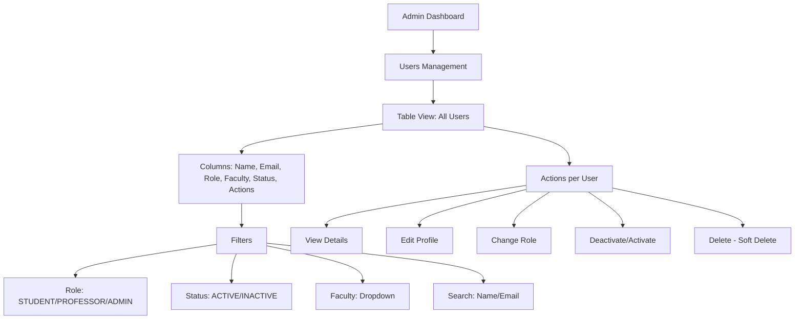
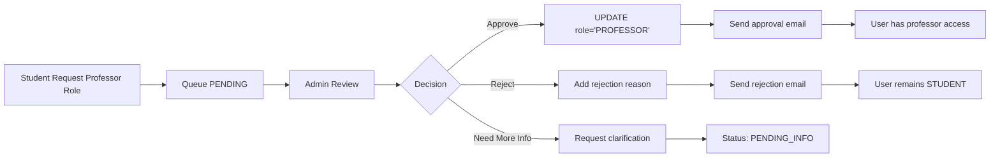
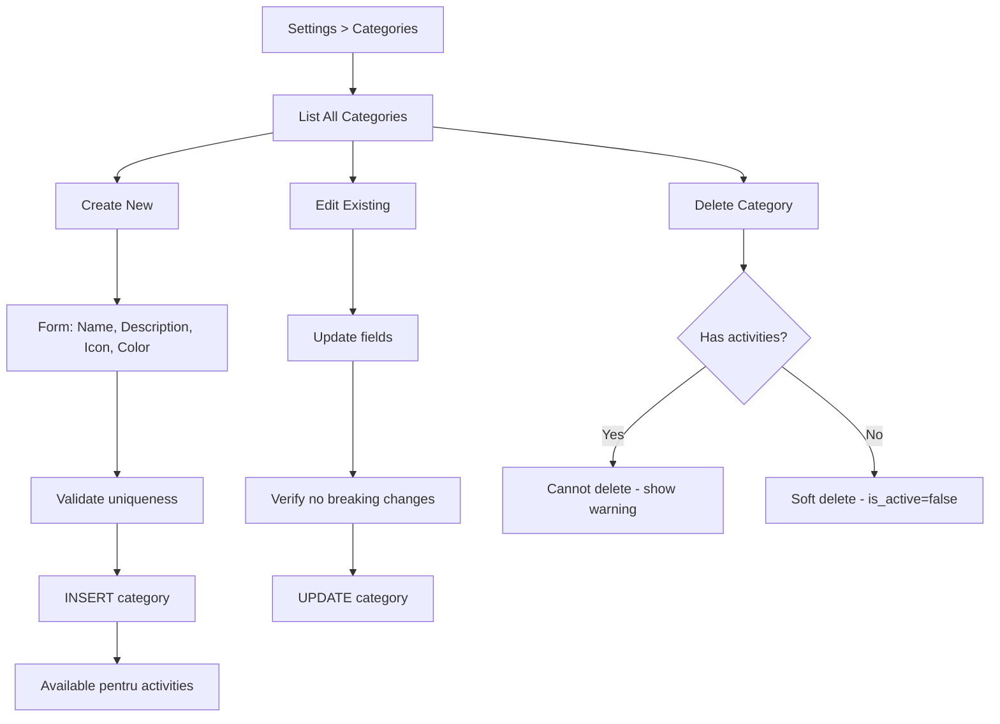
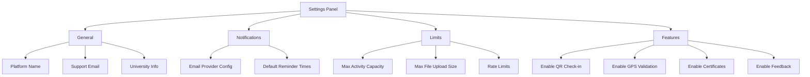
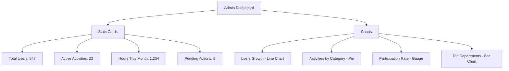
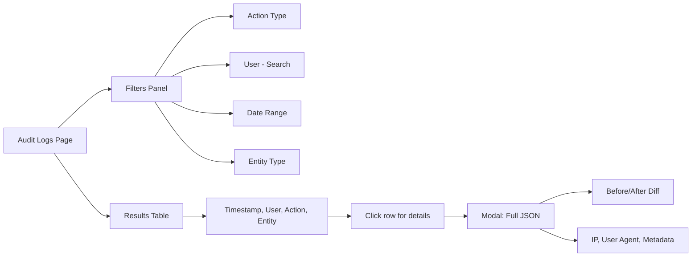
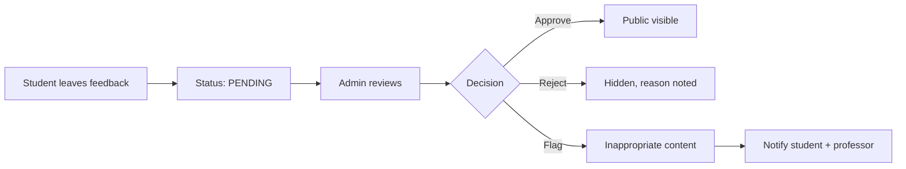

# Rol: Administrator

**Autori**: Mihai Octavian & Abbasi Pazeyazd Bianca-Maria  
**Versiune**: 1.0  
**Data**: Decembrie 2024  

---

## Prezentare Generală

Rolul de **Administrator** reprezintă utilizatorul cu cele mai extinse permisiuni în platforma CampusConnect, având control complet asupra sistemului, utilizatorilor și configurațiilor globale.

**Responsabilități Principale**:
- Management complet utilizatori (CRUD, role assignment)
- Aprobare cereri rol profesor
- Configurare platformă (categorii, departamente, setări)
- Monitorizare sistem și audit logs
- Management template-uri email
- Oversight activități și moderare conținut

---

## Funcționalități Principale

### 1. 👥 Management Utilizatori

#### 1.1 User List & Search

**Dashboard Users Page**: Tabel complet cu toți utilizatorii



**Columns Displayed**:

| Coloană | Descriere | Sortable |
|---------|-----------|----------|
| **Avatar** | Profile picture sau initiale | ❌ |
| **Nume** | Prenume + Nume de familie | ✅ |
| **Email** | Email universitar | ✅ |
| **Rol** | STUDENT / PROFESSOR / ADMIN | ✅ |
| **Facultate** | Faculty afiliation | ✅ |
| **Status** | ACTIVE / INACTIVE | ✅ |
| **Created** | Data înregistrare | ✅ |
| **Last Login** | Ultima autentificare | ✅ |
| **Actions** | Quick actions dropdown | ❌ |

#### 1.2 Change User Role

**Process**:

```mermaid
sequenceDiagram
    participant A as Admin
    participant UI as Interface
    participant API as Backend
    participant DB as Database
    participant N as Notifications

    A->>UI: Click "Change Role" pe user
    UI->>UI: Open modal cu role selector
    A->>UI: Select new role (PROFESSOR)
    A->>UI: Confirm change
    UI->>API: PATCH /api/admin/users/{id}/role
    API->>API: Verify admin permissions
    API->>DB: UPDATE profiles SET role='PROFESSOR'
    DB->>API: Success
    API->>DB: INSERT audit_log
    API->>N: Send notification to user
    N->>User: "Rolul tău a fost schimbat la PROFESSOR"
    API->>UI: Role updated
    UI->>A: Success toast + refresh table
```



**Role Change Rules**:
- ❌ **Nu poți schimba propriul rol** - Prevent admin lockout
- ⚠️ **Confirmation dialog** pentru ADMIN → altceva
- 📝 **Audit log** pentru fiecare schimbare
- ✉️ **Email notification** către user afectat

#### 1.3 Bulk User Actions

**Use Cases**:
- Promovare batch studenți la profesori (ex: teaching assistants)
- Deactivare studenți absolvenți
- Export liste pentru raportări oficiale

**Available Bulk Actions**:

| Acțiune | Descriere | Max Users | Confirmation |
|---------|-----------|-----------|--------------|
| **Change Role** | Schimbă rol pentru mulți users | 100 | ✅ Required |
| **Deactivate** | Disable login pentru users | 100 | ✅ Required |
| **Activate** | Re-enable login | 100 | ❌ Optional |
| **Export CSV** | Download user data | Unlimited | ❌ No |
| **Send Notification** | Mass message | 500 | ✅ Required |

**Bulk Change Role Flow**:

```typescript
// Frontend
const selectedUsers = [userId1, userId2, userId3];
const newRole = 'PROFESSOR';

await fetch('/api/admin/users/bulk', {
  method: 'POST',
  body: JSON.stringify({
    action: 'change_role',
    user_ids: selectedUsers,
    new_role: newRole
  })
});

// Backend validation
- Verify admin role
- Check rate limits (max 5 bulk ops/minute)
- Prevent self-modification
- Transaction: All or nothing
- Audit log each change
- Send notifications
```

#### 1.4 User Detail Modal

**Click "View Details"** → Comprehensive User Profile

**Tabs**:

1. **Profile Info**:
   - Personal: Nume, Email, Phone, Avatar
   - Academic: Faculty, Specialization, Year, GPA
   - System: Created, Last Login, Email Verified

2. **Activity** (doar Students/Professors):
   - Studenți: Enrollments, Hours, Certificates
   - Profesori: Activities Created, Students Managed, Hours Approved

3. **Audit Trail**:
   - Login history (last 20)
   - Role changes
   - Profile modifications
   - Suspicious activity flags

4. **Actions**:
   - Edit profile fields
   - Reset password (send email)
   - Deactivate account
   - Delete account (soft delete cu confirmation)

---

### 2. ✅ Aprobare Cereri Profesor

#### 2.1 Professor Approval Queue

**Dashboard**: Tab "Professor Requests"



**Request Card View**:

Each request displays:
- **User Info**: Numele, Email, Faculty
- **Requested Department**: Care departament coordonează
- **Justification**: Textul motivației (min 100 chars)
- **Supporting Documents**: PDF/images uploaded (dacă există)
- **Submitted**: Timestamp cerere
- **Status**: PENDING / APPROVED / REJECTED / PENDING_INFO

**Quick Actions**:
- ✅ **Quick Approve**: Aprobare cu 1 click (no notes)
- ❌ **Quick Reject**: Standard rejection reason
- 📋 **Detailed Review**: Modal cu form complet

#### 2.2 Detailed Review Process

**Modal Content**:

**Left Panel** - User Profile:
- Complete profile info
- Academic standing (GPA, year)
- Platform history: Activities enrolled, hours logged
- Trust score: Account age, email verified, completeness

**Right Panel** - Request Details:
- Department requested
- Full justification text
- Attached documents (preview inline)
- History: Previous requests (dacă există rejections)

**Decision Form**:

✅ **Approve**:
- Optional: Admin notes (internal, nu se trimite la user)
- Confirm: "Promote {name} to PROFESSOR?"
- Execute: Role change + email + notification

❌ **Reject**:
- **Required**: Rejection reason (min 50 chars)
- Template reasons (quick select):
  - "Justificare insuficientă - te rugăm să detaliezi experiența ta"
  - "Documente lipsă - trimite dovezi afiliere departament"
  - "Email nu este verificat - verifică emailul mai întâi"
  - Custom: Write your own
- Send: Email cu motiv + opțiune re-submit

⏸️ **Request More Info**:
- Message to user: "Ce informații lipsesc?"
- Status → PENDING_INFO
- User notificat să completeze

#### 2.3 Approval Analytics

**Metrics Dashboard**:

| Metric | Formula | Display |
|--------|---------|---------|
| **Pending Requests** | COUNT WHERE status=PENDING | Number badge |
| **Approval Rate** | APPROVED / TOTAL | Percentage |
| **Avg Processing Time** | AVG(reviewed_at - created_at) | Days |
| **Rejected Reasons** | GROUP BY rejection_reason | Pie chart |

---

### 3. ⚙️ Platform Configuration

#### 3.1 Categories Management

**CRUD Operations pentru Activity Categories**:



**Category Fields**:

| Field | Type | Validation | Required |
|-------|------|------------|----------|
| **Name** | Text | Unique, 3-50 chars | ✅ |
| **Description** | Textarea | Max 500 chars | ❌ |
| **Icon** | Emoji/Unicode | Single character | ❌ |
| **Color** | Color Picker | Hex code (#RRGGBB) | ❌ |
| **Is Active** | Boolean | - | ✅ |

**Default Categories** (seeded):
- 📚 Academic Support (Blue #3B82F6)
- 🤝 Community Service (Green #10B981)
- 🎉 Event Assistance (Purple #8B5CF6)
- 👨‍🏫 Mentorship (Orange #F59E0B)
- 🔬 Research (Red #EF4444)
- 💻 Technical (Cyan #06B6D4)

#### 3.2 Departments Management

**CRUD pentru University Departments**:

**Create Department Form**:

| Field | Description | Example |
|-------|-------------|---------|
| **Name** | Full department name | "Societatea de Electronică" |
| **Short Code** | Acronym (unique) | "SocE" |
| **Description** | About department | "Organizează workshop-uri tehnice..." |
| **Contact Name** | Responsible person | "Prof. Dr. Ion Popescu" |
| **Contact Email** | Department email | "soce@university.ro" |
| **Logo URL** | Department logo | Upload sau external URL |
| **Is Active** | Enable/disable | true |

**Department Actions**:
- **View Activities**: Vezi toate activitățile departamentului
- **View Professors**: Lista profesori afiliați
- **Edit Info**: Update contact, description
- **Deactivate**: Hide from dropdowns (nu șterge)

#### 3.3 Email Templates Management

**Navigate**: Settings > Email Templates

```mermaid
graph LR
    A[Email Templates Page] --> B[List Templates]
    B --> C[System Templates - Default]
    B --> D[Department Templates - Custom]
    
    E[Create Template] --> F[Select Type]
    F --> G[enrollment_confirmed]
    F --> H[hours_approved]
    F --> I[activity_reminder]
    
    G --> J[Subject + Body HTML]
    J --> K[Variables: {{student_name}}, {{activity_title}}]
    K --> L[Preview with sample data]
    L --> M[Save template]
```

**Template Types Available**:

| Type | When Sent | Recipients |
|------|-----------|------------|
| `enrollment_confirmed` | Student enrolled | Student |
| `enrollment_cancelled` | Enrollment cancelled | Student |
| `activity_reminder` | 24h before session | Enrolled students |
| `hours_approved` | Professor approves | Student |
| `hours_rejected` | Professor rejects | Student |
| `certificate_ready` | Auto-generated | Student |
| `activity_created` | New activity published | Matched students |
| `professor_approved` | Role change | New professor |

**Template Editor Features**:
- **Rich Text Editor**: WYSIWYG cu HTML support
- **Variable Insertion**: Click to insert {{variable}}
- **Preview Mode**: Test cu date sample
- **Version History**: Track changes (planned)
- **Department Override**: Custom templates per department

**Predefined Variables**:

```typescript
const VARIABLES = {
  // User
  '{{student_name}}': 'Numele studentului',
  '{{student_email}}': 'Email student',
  '{{professor_name}}': 'Numele profesorului',
  
  // Activity
  '{{activity_title}}': 'Titlu activitate',
  '{{activity_date}}': 'Data desfășurare',
  '{{activity_location}}': 'Locație',
  '{{activity_hours}}': 'Ore alocate',
  
  // System
  '{{platform_name}}': 'Campus Connect',
  '{{dashboard_link}}': 'Link către dashboard',
  '{{support_email}}': 'Email suport',
};
```

#### 3.4 Platform Settings

**Global Configuration**:



**Settings Schema**:

```typescript
interface PlatformConfig {
  general: {
    platform_name: string;
    university_name: string;
    support_email: string;
    logo_url: string;
  };
  
  notifications: {
    reminder_24h_enabled: boolean;
    reminder_1h_enabled: boolean;
    email_provider: 'supabase' | 'sendgrid' | 'resend';
  };
  
  limits: {
    max_activity_participants: number; // Default: 500
    max_file_size_mb: number; // Default: 5
    max_files_per_upload: number; // Default: 10
    rate_limit_requests_per_minute: number; // Default: 100
  };
  
  features: {
    qr_checkin_enabled: boolean;
    gps_validation_enabled: boolean;
    certificates_auto_generate: boolean;
    feedback_enabled: boolean;
    waiting_list_enabled: boolean;
  };
}
```

---

### 4. 📊 Analytics și Monitoring

#### 4.1 Executive Dashboard

**Top-Level Metrics**:



**Detailed Metrics Table**:

| Category | Metric | Current | Last Month | Change |
|----------|--------|---------|------------|--------|
| **Users** | Total Active | 547 | 512 | +6.8% 📈 |
| **Users** | Students | 520 | 495 | +5.1% |
| **Users** | Professors | 25 | 16 | +56% 🔥 |
| **Users** | Admins | 2 | 1 | +100% |
| **Activities** | Total Created | 156 | 142 | +9.9% |
| **Activities** | Active (OPEN) | 23 | 18 | +27.8% |
| **Engagement** | Total Hours | 12,450 | 11,200 | +11.2% |
| **Engagement** | Avg Hours/Student | 24 | 23 | +4.3% |

#### 4.2 User Analytics

**Segmentation**:
- By Role: Students vs Professors distribution
- By Faculty: Which faculties most active
- By Year: Participation per academic year
- By Engagement: Active (>5 hours) vs Inactive

**Cohort Analysis** (planned):
- Retention by signup month
- Activation rate (completed profile %)
- Churn prediction

#### 4.3 Activity Analytics

**Performance Metrics**:

| Activity | Participants | Attendance Rate | Avg Rating | Hours Awarded |
|----------|-------------|-----------------|------------|---------------|
| STEM Mentorship | 45/50 | 93% 🟢 | 4.8/5 ⭐ | 135 |
| Campus Cleanup | 18/20 | 72% 🟡 | 4.2/5 | 36 |
| Code Workshop | 30/30 | 88% 🟢 | 4.9/5 | 90 |

**Filters**:
- Date range: Last 7 days, 30 days, 90 days, Custom
- Department: All, specific department
- Category: All, specific category
- Status: OPEN, IN_PROGRESS, COMPLETED, CANCELLED

---

### 5. 🔍 Audit Logs Viewer

#### 5.1 Comprehensive Audit Trail

**All Critical Actions Logged**:

```typescript
interface AuditLog {
  id: string;
  timestamp: Date;
  user_id: string; // Who performed
  action: AuditAction;
  entity_type: 'profiles' | 'activities' | 'enrollments' | 'hours_requests';
  entity_id: string; // What was affected
  details: Record<string, any>; // JSON with before/after
  ip_address: string;
  user_agent: string;
}

type AuditAction =
  | 'USER_LOGIN'
  | 'USER_LOGOUT'
  | 'USER_CREATED'
  | 'USER_UPDATED'
  | 'ROLE_CHANGED'
  | 'ACTIVITY_CREATED'
  | 'ACTIVITY_UPDATED'
  | 'ACTIVITY_DELETED'
  | 'ENROLLMENT_CREATED'
  | 'ENROLLMENT_CANCELLED'
  | 'HOURS_APPROVED'
  | 'HOURS_REJECTED'
  | 'CONFIG_UPDATED';
```

#### 5.2 Audit Viewer Interface



**Advanced Filters**:

```typescript
interface AuditFilters {
  actions?: AuditAction[]; // Multi-select
  user_id?: string; // Specific user
  entity_type?: string;
  start_date?: Date;
  end_date?: Date;
  ip_address?: string; // Track suspicious IPs
  search?: string; // Full-text în details JSON
}
```

**Example Log Entry**:

```json
{
  "id": "log-uuid",
  "timestamp": "2024-12-02T15:30:00Z",
  "user_id": "admin-uuid",
  "action": "ROLE_CHANGED",
  "entity_type": "profiles",
  "entity_id": "student-uuid",
  "details": {
    "old_role": "STUDENT",
    "new_role": "PROFESSOR",
    "changed_by": "admin@university.ro",
    "reason": "Promoted to teaching assistant"
  },
  "ip_address": "192.168.1.100",
  "user_agent": "Mozilla/5.0..."
}
```

#### 5.3 Security Monitoring

**Flagged Events** (automated alerts):
- Multiple failed login attempts (>5 în 10 min)
- Role changes to ADMIN
- Bulk user modifications (>20 users)
- Config changes affecting security
- Unusual IP addresses (geo-location change)

**Alert Actions**:
- Email către super admin
- In-app notification urgent
- Temporary account freeze (planned)
- Required 2FA for sensitive ops (planned)

---

### 6. 📧 Mass Communication

#### 6.1 Broadcast Notifications

**Use Cases**:
- Platform maintenance announcements
- New features launch
- Important policy changes
- Emergency communications

**Compose Broadcast**:

| Field | Description | Example |
|-------|-------------|---------|
| **Recipients** | Who receives | All Users / Students Only / Professors / Custom filter |
| **Type** | Notification channel | In-App / Email / Both |
| **Priority** | Urgency level | Low / Normal / High / Urgent |
| **Title** | Short headline | "Platform Maintenance - Dec 5" |
| **Message** | Full content | Rich text editor |
| **Link** | Call-to-action URL | Optional redirect |
| **Schedule** | Send time | Now / Schedule for later |

**Recipient Filters**:
```typescript
interface BroadcastFilters {
  roles?: ('STUDENT' | 'PROFESSOR' | 'ADMIN')[];
  faculties?: string[];
  years?: number[]; // Academic years
  departments?: string[];
  min_hours?: number; // Users with >= X hours
  last_login?: Date; // Active since...
}
```

**Preview Before Send**:
- Estimated recipients count
- Sample notification preview
- Cost estimation (if using paid email service)

#### 6.2 Targeted Campaigns

**Segment-Based Messaging**:

1. **Inactive Users** (no login >30 days):
   - "We miss you! Check out new activities"
   
2. **High Performers** (>50 hours):
   - "Congratulations! You're in top 10% volunteers"
   
3. **Near Completion** (45-49 hours, goal: 50):
   - "Just 5 more hours to reach your goal!"

---

### 7. 🛡️ Moderation și Content Management

#### 7.1 Activity Moderation

**Admin Oversight**:
- View **all activities** regardless of department
- Edit any activity (with audit trail)
- Cancel activities (with notification to enrolled students)
- Feature activities (pin to homepage)

**Content Guidelines Enforcement**:
- Review reported activities
- Check for inappropriate content
- Verify authenticity (no spam/fake activities)
- Ensure eligibility criteria are fair

#### 7.2 Feedback Moderation

**Student Feedback Review**:



**Moderation Criteria**:
- ✅ Approve: Constructive, specific, respectful
- ❌ Reject: Offensive language, personal attacks
- ⚠️ Flag: Potential policy violations

---

### 8. 🔧 System Maintenance

#### 8.1 Database Management

**Admin Tools** (planned):
- View table statistics (row counts, disk usage)
- Analyze slow queries
- Rebuild indexes (with expert guidance)
- Vacuum database (cleanup deleted rows)

**Backup & Recovery**:
- Automated daily backups (Supabase)
- Manual backup trigger
- Point-in-time recovery (last 7 days)
- Export critical tables to CSV

#### 8.2 Cache Management

**Clear Caches**:
- TanStack Query cache (client-side)
- Edge cache (Vercel CDN)
- Database query cache (Supabase)

**When to Clear**:
- After bulk data changes
- When stale data reported
- Before major updates

---

## Restricții și Limitări

### Ce NU poate face chiar Admin?

❌ **Nu poate vedea parolele utilizatorilor** - Hashed în Supabase Auth  
❌ **Nu poate edita baza de date direct** - RLS policies apply even to admin  
❌ **Nu poate accesa datele personale fără scop** - GDPR compliance  
❌ **Nu poate șterge hard permanent** - Toate delete-urile sunt soft delete  
❌ **Nu poate modifica audit logs** - Append-only, immutable  

### Safety Mechanisms

**Prevent Accidents**:
- Confirmation dialogs pentru acțiuni distructive
- "Undo" pentru unele operații (planned)
- Dry-run mode pentru bulk actions (preview)
- Rate limits chiar și pentru admin (abuse prevention)

**Multi-Admin Safeguards**:
- Last admin cannot be demoted
- Critical actions require 2 admins approval (planned)
- Audit trail pentru admin actions

---

## Best Practices pentru Admini

### 🎯 User Management

1. **Regular Cleanup**: Review inactive users quarterly
2. **Professor Approvals**: Process în max 24h (SLA)
3. **Bulk Actions**: Always preview before execute
4. **Communication**: Notify users before mass changes

### 📊 Monitoring

1. **Daily Check**: Review dashboard metrics
2. **Weekly Audit**: Check audit logs pentru anomalii
3. **Monthly Report**: Analytics export pentru management
4. **Quarterly Review**: User satisfaction surveys

### 🔒 Security

1. **Strong Password**: Min 16 chars, special characters
2. **2FA Enable**: (când va fi disponibil)
3. **IP Whitelist**: (pentru production access)
4. **Regular Password Change**: La 90 zile

### ⚙️ Configuration

1. **Test Changes**: În staging environment first
2. **Document Config**: Note why settings changed
3. **Rollback Plan**: Know how to revert
4. **Notify Team**: Before major config updates

---

## FAQ Administratori

**Î: Cum adaug un nou admin?**  
R: Change role pentru user existent la ADMIN. Important: Asigură-te că persoana este de încredere.

**Î: Pot șterge permanent un utilizator?**  
R: Nu direct. Delete este soft (deleted_at). Pentru hard delete, contactează suport cu justificare GDPR.

**Î: Ce fac dacă un profesor abuzează de sistem?**  
R: Deactivate account temporar, review audit logs, contactează direct. Dacă confirmat: demote la STUDENT sau ban.

**Î: Cum creez o copie backup înainte de bulk action?**  
R: Supabase face automated backups daily. Pentru siguranță extra: Export CSV înainte de modificări majore.

**Î: Pot delega unele task-uri admin către profesori?**  
R: Nu. Admin permissions sunt all-or-nothing. Consideră crearea unei documentații pentru self-service.

**Î: Ce fac când primesc alerte de securitate?**  
R: 1) Check audit logs, 2) Verify IP addresses, 3) Dacă suspect: freeze account, 4) Notify user, 5) Require password reset.

**Î: Cum gestionez GDPR data deletion requests?**  
R: 1) Verify identitate user, 2) Export datele (right to data portability), 3) Soft delete account, 4) După 30 zile: contact Supabase support pentru hard delete.

---

**Document creat de**: Mihai Octavian & Abbasi Pazeyazd Bianca-Maria  
**Ultima actualizare**: Decembrie 2024  
**Versiune**: 1.0
