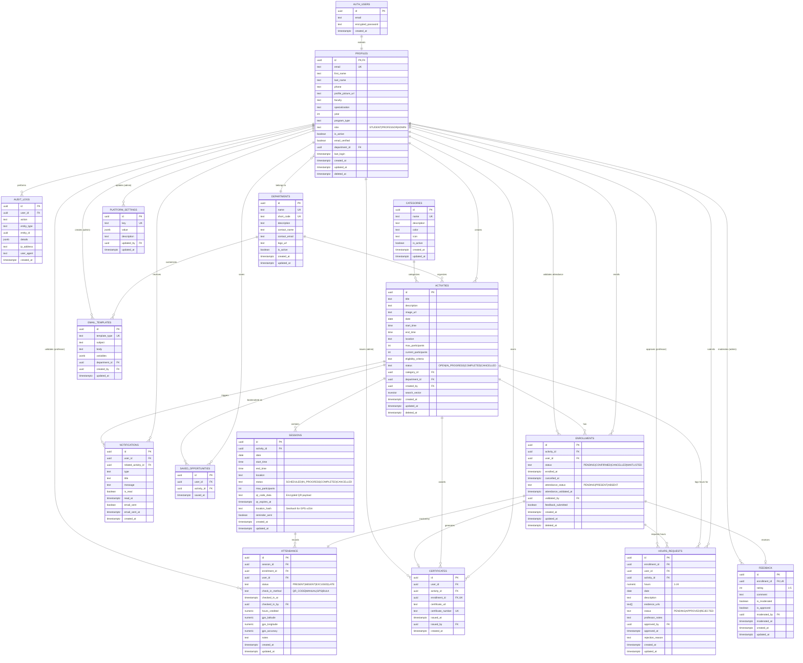

# Campus Connect - Database Schema Diagram

## Entity Relationship Diagram



## Database Statistics

| Table | Rows | RLS Enabled | Purpose |
|-------|------|-------------|---------|
| **profiles** | 1 | ✅ | User accounts (students, professors, admins) |
| **departments** | 6 | ✅ | University departments |
| **categories** | 6 | ✅ | Activity categorization |
| **activities** | 5 | ✅ | Volunteer opportunities |
| **sessions** | 0 | ✅ | Activity sessions with QR/GPS validation |
| **enrollments** | 5 | ✅ | Student enrollments in activities |
| **attendance** | 0 | ✅ | Session attendance tracking |
| **hours_requests** | 0 | ✅ | Hours logging with validation |
| **saved_opportunities** | 0 | ✅ | Student bookmarks |
| **notifications** | 4 | ✅ | In-app and email notifications |
| **certificates** | 0 | ✅ | Generated participation certificates |
| **feedback** | 0 | ✅ | Student activity feedback |
| **email_templates** | 6 | ✅ | Customizable email templates |
| **audit_logs** | 14 | ✅ | System audit trail |
| **platform_settings** | 11 | ✅ | Global configuration |

## Key Relationships

### 1️⃣ User Management
- **auth.users** → **profiles** (1:1) - Extends Supabase Auth
- **profiles** ← **departments** (N:1) - Department affiliation

### 2️⃣ Activity Organization
- **activities** ← **categories** (N:1) - Activity categorization
- **activities** ← **departments** (N:1) - Department ownership
- **activities** ← **profiles** (N:1 via created_by) - Creator tracking
- **activities** → **sessions** (1:N) - Multi-session activities

### 3️⃣ Enrollment Flow
```
STUDENT → enrolls in → ACTIVITY
       ↓
  ENROLLMENT (status: PENDING → CONFIRMED)
       ↓
  SESSIONS → ATTENDANCE (QR/GPS validation)
       ↓
  HOURS_REQUESTS (professor approval)
       ↓
  CERTIFICATE (if approved)
```

### 4️⃣ Attendance Validation
- **Manual**: Professor marks attendance directly
- **QR Code**: Student scans QR at session location
- **GPS**: Location-based automatic check-in (±15m accuracy)
- **Bulk**: Professor uploads attendance list

### 5️⃣ Hours Workflow
```
STUDENT → creates HOURS_REQUEST
       ↓
PROFESSOR → reviews evidence → APPROVES/REJECTS
       ↓
APPROVED → hours added to student total
```

### 6️⃣ Notification System
- Activity updates → enrolled students
- Enrollment confirmations → student
- Attendance validation → student
- Certificate ready → student
- Hours approved/rejected → student
- Session reminders → 24h and 1h before

## Security Features

### Row Level Security (RLS)
✅ All tables have RLS enabled

### Soft Deletes
- `profiles.deleted_at`
- `activities.deleted_at`
- `enrollments.deleted_at`

### Audit Trail
- `audit_logs` tracks all critical actions
- Records: user, action, entity, IP, user agent

### Data Validation
- Check constraints on enums (status fields)
- Numeric ranges (hours: 1-24, rating: 1-5, year: 1-6)
- Unique constraints (emails, certificate numbers)

## Performance Optimizations

### Indexes
- **profiles**: email, role, faculty
- **activities**: date, status, category, created_by, date+status composite
- **enrollments**: activity, user, status, attendance_status
- **notifications**: user, unread (filtered), created_at DESC
- **audit_logs**: user, action, created_at DESC, entity composite

### Full-Text Search
- **activities.search_vector**: Weighted search on title (A), description (B), location (C)

### Geospatial
- **sessions.location_hash**: Geohash for efficient proximity queries (±15m)

## Data Flow Examples

### Student Enrolls in Activity
```
1. Student browses /explore
2. Clicks "Enroll" → creates ENROLLMENT (status: CONFIRMED)
3. activities.current_participants += 1
4. NOTIFICATION created for student
5. EMAIL sent to student (enrollment_confirmed template)
```

### Professor Validates Attendance (QR Code)
```
1. Professor starts session → generates QR code
2. sessions.qr_code_data = encrypted payload
3. sessions.qr_expires_at = session end time
4. Student scans QR → validates payload + GPS (optional)
5. ATTENDANCE created (check_in_method: QR_CODE)
6. enrollments.attendance_status = PRESENT
7. NOTIFICATION sent to student
```

### Student Requests Hours
```
1. Student completes activity
2. Creates HOURS_REQUEST with evidence (photos, docs)
3. Professor receives notification
4. Professor reviews → APPROVES or REJECTS
5. If approved: hours added to student total
6. NOTIFICATION + EMAIL sent to student
7. If all hours complete → CERTIFICATE generated
```

## Notes

- **UUID Primary Keys**: All tables use UUID for distributed system compatibility
- **Timestamps**: All tables have created_at, many have updated_at
- **Foreign Key Constraints**: Maintain referential integrity with CASCADE/SET NULL
- **JSONB Fields**: Flexible storage for details, variables, platform settings
- **Array Fields**: hours_requests.evidence_urls for multiple file uploads
- **Generated Columns**: activities.search_vector auto-updated on title/description changes
