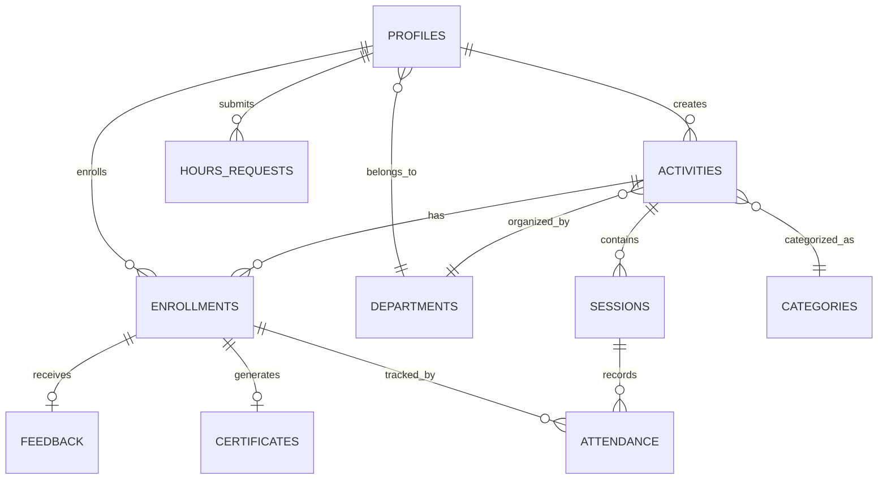

# Schema Bazei de Date - CampusConnect

**Autori**: Mihai Octavian & Abbasi Pazeyazd Bianca-Maria  
**Versiune**: 1.0  
**Data**: Decembrie 2024  

---

## 1. Prezentare Generală

CampusConnect folosește **PostgreSQL 15** prin Supabase ca sistem de management al bazei de date. Schema este optimizată pentru:
- **Performanță**: Indecși strategici, query optimization
- **Securitate**: Row Level Security (RLS) pe toate tabelele
- **Scalabilitate**: Normalizare până la 3NF, foreign keys
- **Integritate**: Constraints, triggers, validări

**Statistici Schema**:
- **15 tabele principale**
- **50+ politici RLS**
- **25+ indecși**
- **10+ funcții PL/pgSQL**
- **8 triggere automate**

---

## 2. Tabele Principale

### 2.1 `profiles` - Profiluri Utilizatori

**Scop**: Extinde `auth.users` din Supabase Auth cu date suplimentare

**Relație**: 1:1 cu `auth.users`, FK către `departments`

```sql
CREATE TABLE public.profiles (
  -- Primary Key
  id UUID PRIMARY KEY REFERENCES auth.users(id) ON DELETE CASCADE,
  
  -- Contact Info
  email TEXT UNIQUE NOT NULL,
  first_name TEXT NOT NULL,
  last_name TEXT NOT NULL,
  phone TEXT,
  profile_picture_url TEXT,
  
  -- Academic Info (doar studenți)
  faculty TEXT,
  specialization TEXT,
  year INTEGER CHECK (year >= 1 AND year <= 6),
  program_type TEXT CHECK (program_type IN ('BACHELOR', 'MASTER', 'PHD')),
  gpa DECIMAL(3,2) CHECK (gpa >= 1.0 AND gpa <= 10.0),
  
  -- System Info
  role TEXT NOT NULL DEFAULT 'STUDENT' 
    CHECK (role IN ('STUDENT', 'PROFESSOR', 'ADMIN')),
  is_active BOOLEAN DEFAULT TRUE NOT NULL,
  email_verified BOOLEAN DEFAULT FALSE NOT NULL,
  department_id UUID REFERENCES public.departments(id) ON DELETE SET NULL,
  
  -- Preferences (JSONB pentru flexibilitate)
  notification_preferences JSONB DEFAULT '{
    "email_enabled": true,
    "enrollment_confirmed": true,
    "activity_reminder": true,
    "hours_approved": true
  }'::jsonb,
  
  -- Audit Fields
  last_login TIMESTAMPTZ,
  created_at TIMESTAMPTZ DEFAULT NOW() NOT NULL,
  updated_at TIMESTAMPTZ DEFAULT NOW() NOT NULL,
  deleted_at TIMESTAMPTZ
);
```

**Indecși**:
```sql
CREATE INDEX idx_profiles_email ON profiles(email);
CREATE INDEX idx_profiles_role ON profiles(role);
CREATE INDEX idx_profiles_faculty ON profiles(faculty);
CREATE INDEX idx_profiles_department ON profiles(department_id);
CREATE INDEX idx_profiles_active ON profiles(is_active) WHERE is_active = TRUE;
```

**Triggere**:
```sql
-- Auto-update updated_at
CREATE TRIGGER update_profiles_updated_at
  BEFORE UPDATE ON profiles
  FOR EACH ROW
  EXECUTE FUNCTION update_updated_at_column();

-- Prevent email change after verification
CREATE TRIGGER prevent_verified_email_change
  BEFORE UPDATE ON profiles
  FOR EACH ROW
  WHEN (OLD.email_verified = TRUE AND NEW.email != OLD.email)
  EXECUTE FUNCTION prevent_email_change();
```

**Exemple Date**:
```sql
-- Student
INSERT INTO profiles VALUES (
  'uuid-student',
  'maria.popescu@univ.ro',
  'Maria',
  'Popescu',
  '+40712345678',
  'https://storage/avatars/maria.jpg',
  'Engineering',
  'Computer Science',
  3,
  'BACHELOR',
  9.50,
  'STUDENT',
  true,
  true,
  'dept-uuid',
  DEFAULT,
  NOW(),
  NOW(),
  NOW(),
  NULL
);

-- Profesor
INSERT INTO profiles VALUES (
  'uuid-prof',
  'ion.ionescu@univ.ro',
  'Ion',
  'Ionescu',
  NULL,
  NULL,
  NULL, -- Nu are faculty (e profesor)
  NULL,
  NULL,
  NULL,
  NULL,
  'PROFESSOR',
  true,
  true,
  'dept-uuid',
  DEFAULT,
  NOW(),
  NOW(),
  NOW(),
  NULL
);
```

---

### 2.2 `departments` - Departamente Universitare

**Scop**: Organizații care coordonează activități

```sql
CREATE TABLE public.departments (
  id UUID PRIMARY KEY DEFAULT gen_random_uuid(),
  
  -- Department Info
  name TEXT UNIQUE NOT NULL,
  short_code TEXT UNIQUE NOT NULL, -- Ex: "SocE", "BEST"
  description TEXT,
  
  -- Contact
  contact_name TEXT,
  contact_email TEXT,
  logo_url TEXT,
  
  -- Status
  is_active BOOLEAN DEFAULT TRUE,
  
  -- Audit
  created_at TIMESTAMPTZ DEFAULT NOW(),
  updated_at TIMESTAMPTZ DEFAULT NOW()
);
```

**Seed Data**:
```sql
INSERT INTO departments (name, short_code, description) VALUES
  ('Societatea de Electronică', 'SocE', 'Workshop-uri tehnice și competiții'),
  ('BEST București', 'BEST', 'Board of European Students of Technology'),
  ('Liga Studenților', 'LSAC', 'Evenimente culturale și sociale'),
  ('Societatea de Robotică', 'SocRob', 'Competiții și tutoriale robotică'),
  ('Departamentul de Informatică', 'CS Dept', 'Support academic'),
  ('Volunteers Club', 'VC', 'Voluntariat comunitar');
```

---

### 2.3 `categories` - Categorii Activități

**Scop**: Clasificare activități pentru filtrare

```sql
CREATE TABLE public.categories (
  id UUID PRIMARY KEY DEFAULT gen_random_uuid(),
  
  -- Category Details
  name TEXT UNIQUE NOT NULL,
  description TEXT,
  icon TEXT, -- Unicode emoji sau icon name
  color TEXT, -- Hex color code
  
  -- Status
  is_active BOOLEAN DEFAULT TRUE NOT NULL,
  
  -- Audit
  created_at TIMESTAMPTZ DEFAULT NOW() NOT NULL,
  updated_at TIMESTAMPTZ DEFAULT NOW() NOT NULL
);
```

**Seed Data**:
```sql
INSERT INTO categories (name, description, icon, color) VALUES
  ('Academic Support', 'Tutoriat, meditații, workshop-uri', '📚', '#3B82F6'),
  ('Community Service', 'Voluntariat comunitar, proiecte sociale', '🤝', '#10B981'),
  ('Event Assistance', 'Organizare evenimente, conferințe', '🎉', '#8B5CF6'),
  ('Mentorship', 'Mentorat studenți, ghidare carieră', '👨‍🏫', '#F59E0B'),
  ('Research', 'Asistență cercetare, proiecte R&D', '🔬', '#EF4444'),
  ('Technical', 'Support IT, dezvoltare software', '💻', '#06B6D4');
```

---

### 2.4 `activities` - Activități Voluntariat

**Scop**: Oportunități create de profesori

**Relații**: 
- N:1 cu `categories`
- N:1 cu `departments`
- N:1 cu `profiles` (created_by)

```sql
CREATE TABLE public.activities (
  id UUID PRIMARY KEY DEFAULT gen_random_uuid(),
  
  -- Basic Info
  title TEXT NOT NULL CHECK (length(title) >= 10 AND length(title) <= 200),
  description TEXT NOT NULL CHECK (length(description) >= 100),
  image_url TEXT,
  
  -- Schedule
  date DATE NOT NULL,
  start_time TIME NOT NULL,
  end_time TIME NOT NULL CHECK (end_time > start_time),
  location TEXT NOT NULL,
  
  -- Capacity
  max_participants INTEGER NOT NULL CHECK (max_participants > 0 AND max_participants <= 500),
  current_participants INTEGER DEFAULT 0 NOT NULL CHECK (current_participants >= 0),
  
  -- Constraints (pentru participare - opțional)
  eligibility_criteria TEXT CHECK (length(eligibility_criteria) <= 500),
  
  -- Status
  status TEXT DEFAULT 'OPEN' NOT NULL
    CHECK (status IN ('DRAFT', 'OPEN', 'IN_PROGRESS', 'COMPLETED', 'CANCELLED')),
  
  -- Relations
  category_id UUID REFERENCES public.categories(id) ON DELETE SET NULL,
  department_id UUID REFERENCES public.departments(id) ON DELETE SET NULL,
  created_by UUID NOT NULL REFERENCES public.profiles(id) ON DELETE CASCADE,
  
  -- Full-Text Search
  search_vector TSVECTOR GENERATED ALWAYS AS (
    setweight(to_tsvector('english', coalesce(title, '')), 'A') ||
    setweight(to_tsvector('english', coalesce(description, '')), 'B') ||
    setweight(to_tsvector('english', coalesce(location, '')), 'C')
  ) STORED,
  
  -- Audit
  created_at TIMESTAMPTZ DEFAULT NOW() NOT NULL,
  updated_at TIMESTAMPTZ DEFAULT NOW() NOT NULL,
  deleted_at TIMESTAMPTZ
);
```

**Indecși Esențiali**:
```sql
-- Performance pentru query-uri frecvente
CREATE INDEX idx_activities_date ON activities(date);
CREATE INDEX idx_activities_status ON activities(status);
CREATE INDEX idx_activities_category ON activities(category_id);
CREATE INDEX idx_activities_created_by ON activities(created_by);
CREATE INDEX idx_activities_department ON activities(department_id);

-- Composite index pentru /explore filtering
CREATE INDEX idx_activities_date_status 
  ON activities(date, status) 
  WHERE deleted_at IS NULL;

-- Full-text search
CREATE INDEX idx_activities_search ON activities USING GIN(search_vector);

-- Soft delete filter
CREATE INDEX idx_activities_not_deleted 
  ON activities(deleted_at) 
  WHERE deleted_at IS NULL;
```

**Constraint Checks**:
```sql
-- Ensure capacity is not exceeded
ALTER TABLE activities 
  ADD CONSTRAINT chk_capacity_valid 
  CHECK (current_participants <= max_participants);

-- Ensure date is in future (for OPEN activities)
CREATE OR REPLACE FUNCTION check_activity_date()
RETURNS TRIGGER AS $$
BEGIN
  IF NEW.status = 'OPEN' AND NEW.date < CURRENT_DATE THEN
    RAISE EXCEPTION 'Cannot create OPEN activity with past date';
  END IF;
  RETURN NEW;
END;
$$ LANGUAGE plpgsql;

CREATE TRIGGER validate_activity_date
  BEFORE INSERT OR UPDATE ON activities
  FOR EACH ROW
  EXECUTE FUNCTION check_activity_date();
```

---

### 2.5 `sessions` - Sesiuni Activitate

**Scop**: Multiple sessions per activitate (ex: curs săptămânal)

**Relație**: N:1 cu `activities`

```sql
CREATE TABLE public.sessions (
  id UUID PRIMARY KEY DEFAULT gen_random_uuid(),
  
  -- Parent Activity
  activity_id UUID NOT NULL REFERENCES public.activities(id) ON DELETE CASCADE,
  
  -- Session Schedule
  date DATE NOT NULL,
  start_time TIME NOT NULL,
  end_time TIME NOT NULL CHECK (end_time > start_time),
  location TEXT NOT NULL,
  
  -- Status
  status TEXT DEFAULT 'SCHEDULED' NOT NULL
    CHECK (status IN ('SCHEDULED', 'IN_PROGRESS', 'COMPLETED', 'CANCELLED')),
  
  -- Capacity (poate diferi de activitate părinte)
  max_participants INTEGER,
  
  -- QR Code pentru check-in
  qr_code_data TEXT, -- Encrypted payload
  qr_expires_at TIMESTAMPTZ,
  
  -- GPS Validation (pentru anti-fraud)
  location_hash TEXT, -- Geohash pentru ±15m accuracy
  
  -- Notifications
  reminder_sent BOOLEAN DEFAULT FALSE,
  
  -- Audit
  created_at TIMESTAMPTZ DEFAULT NOW(),
  updated_at TIMESTAMPTZ DEFAULT NOW()
);
```

**Indecși**:
```sql
CREATE INDEX idx_sessions_activity ON sessions(activity_id);
CREATE INDEX idx_sessions_date ON sessions(date);
CREATE INDEX idx_sessions_status ON sessions(status);
CREATE INDEX idx_sessions_upcoming 
  ON sessions(date, start_time) 
  WHERE status = 'SCHEDULED';
```

**QR Code Generation Function**:
```sql
CREATE OR REPLACE FUNCTION generate_session_qr(session_id UUID)
RETURNS TEXT AS $$
DECLARE
  qr_payload JSONB;
  encrypted_qr TEXT;
BEGIN
  -- Create payload
  qr_payload := jsonb_build_object(
    'session_id', session_id,
    'timestamp', extract(epoch from now()),
    'expires_at', (SELECT qr_expires_at FROM sessions WHERE id = session_id)
  );
  
  -- Encrypt (în practică, folosim crypto library)
  encrypted_qr := encode(digest(qr_payload::text, 'sha256'), 'hex');
  
  -- Store in DB
  UPDATE sessions 
  SET qr_code_data = encrypted_qr,
      qr_expires_at = (
        SELECT date + end_time 
        FROM sessions 
        WHERE id = session_id
      )
  WHERE id = session_id;
  
  RETURN encrypted_qr;
END;
$$ LANGUAGE plpgsql SECURITY DEFINER;
```

---

### 2.6 `enrollments` - Înscrieri Studenți

**Scop**: Relație M:N între `profiles` și `activities`

**Include**: Application fields (motivation, availability)

```sql
CREATE TABLE public.enrollments (
  id UUID PRIMARY KEY DEFAULT gen_random_uuid(),
  
  -- Relations
  activity_id UUID NOT NULL REFERENCES public.activities(id) ON DELETE CASCADE,
  user_id UUID NOT NULL REFERENCES public.profiles(id) ON DELETE CASCADE,
  
  -- Application Fields (opțional, dacă activitatea cere)
  motivation TEXT, -- De ce vrei să participi?
  availability TEXT, -- Când ești disponibil?
  experience TEXT, -- Experiență relevantă?
  
  -- Enrollment Status
  status TEXT DEFAULT 'CONFIRMED' NOT NULL
    CHECK (status IN ('PENDING', 'CONFIRMED', 'WAITLISTED', 'CANCELLED')),
  enrolled_at TIMESTAMPTZ DEFAULT NOW() NOT NULL,
  cancelled_at TIMESTAMPTZ,
  
  -- Attendance Tracking
  attendance_status TEXT DEFAULT 'PENDING'
    CHECK (attendance_status IN ('PENDING', 'PRESENT', 'ABSENT', 'EXCUSED')),
  attendance_validated_at TIMESTAMPTZ,
  validated_by UUID REFERENCES public.profiles(id),
  
  -- Feedback
  feedback_submitted BOOLEAN DEFAULT FALSE,
  
  -- Professor Communication
  professor_notes TEXT, -- Note profesor despre student
  custom_message TEXT, -- Mesaj personalizat acceptare
  rejection_reason TEXT, -- Dacă CANCELLED de profesor
  reviewed_at TIMESTAMPTZ,
  reviewed_by UUID REFERENCES public.profiles(id),
  
  -- Audit
  created_at TIMESTAMPTZ DEFAULT NOW() NOT NULL,
  updated_at TIMESTAMPTZ DEFAULT NOW() NOT NULL,
  deleted_at TIMESTAMPTZ,
  
  -- Constraints
  UNIQUE(activity_id, user_id) -- Un student = 1 enrollment per activitate
);
```

**Indecși**:
```sql
CREATE INDEX idx_enrollments_activity ON enrollments(activity_id);
CREATE INDEX idx_enrollments_user ON enrollments(user_id);
CREATE INDEX idx_enrollments_status ON enrollments(status);
CREATE INDEX idx_enrollments_attendance ON enrollments(attendance_status);

-- Composite pentru professor dashboard
CREATE INDEX idx_enrollments_activity_status 
  ON enrollments(activity_id, status)
  WHERE deleted_at IS NULL;
```

**Trigger pentru Auto-Increment `current_participants`**:
```sql
CREATE OR REPLACE FUNCTION update_activity_participants()
RETURNS TRIGGER AS $$
BEGIN
  IF TG_OP = 'INSERT' AND NEW.status = 'CONFIRMED' THEN
    UPDATE activities 
    SET current_participants = current_participants + 1
    WHERE id = NEW.activity_id;
    
  ELSIF TG_OP = 'UPDATE' THEN
    IF OLD.status != 'CONFIRMED' AND NEW.status = 'CONFIRMED' THEN
      -- WAITLISTED -> CONFIRMED
      UPDATE activities 
      SET current_participants = current_participants + 1
      WHERE id = NEW.activity_id;
      
    ELSIF OLD.status = 'CONFIRMED' AND NEW.status != 'CONFIRMED' THEN
      -- CONFIRMED -> CANCELLED
      UPDATE activities 
      SET current_participants = current_participants - 1
      WHERE id = NEW.activity_id;
    END IF;
    
  ELSIF TG_OP = 'DELETE' AND OLD.status = 'CONFIRMED' THEN
    UPDATE activities 
    SET current_participants = current_participants - 1
    WHERE id = OLD.activity_id;
  END IF;
  
  RETURN COALESCE(NEW, OLD);
END;
$$ LANGUAGE plpgsql;

CREATE TRIGGER manage_activity_participants
  AFTER INSERT OR UPDATE OR DELETE ON enrollments
  FOR EACH ROW
  EXECUTE FUNCTION update_activity_participants();
```

---

### 2.7 `attendance` - Tracking Prezență Sesiuni

**Scop**: Înregistrare check-in la sesiuni (QR/Manual/GPS)

```sql
CREATE TABLE public.attendance (
  id UUID PRIMARY KEY DEFAULT gen_random_uuid(),
  
  -- Relations
  session_id UUID NOT NULL REFERENCES public.sessions(id) ON DELETE CASCADE,
  enrollment_id UUID NOT NULL REFERENCES public.enrollments(id) ON DELETE CASCADE,
  user_id UUID NOT NULL REFERENCES public.profiles(id) ON DELETE CASCADE,
  
  -- Attendance Status
  status TEXT NOT NULL DEFAULT 'PRESENT'
    CHECK (status IN ('PRESENT', 'ABSENT', 'EXCUSED', 'LATE')),
  
  -- Check-in Method
  check_in_method TEXT NOT NULL
    CHECK (check_in_method IN ('QR_CODE', 'MANUAL', 'GPS', 'BULK')),
  
  -- Check-in Details
  checked_in_at TIMESTAMPTZ DEFAULT NOW() NOT NULL,
  checked_in_by UUID REFERENCES public.profiles(id), -- Profesor (dacă manual)
  
  -- Hours Credited (calculat automat)
  hours_credited DECIMAL(5,2) DEFAULT 0 
    CHECK (hours_credited >= 0 AND hours_credited <= 24),
  
  -- GPS Coordinates (pentru QR_CODE și GPS methods)
  gps_latitude DECIMAL(10,8),
  gps_longitude DECIMAL(11,8),
  gps_accuracy DECIMAL(8,2), -- Metri
  
  -- Notes
  notes TEXT, -- Ex: "Arrived 15 min late due to exam"
  
  -- Audit
  created_at TIMESTAMPTZ DEFAULT NOW() NOT NULL,
  updated_at TIMESTAMPTZ DEFAULT NOW() NOT NULL,
  
  -- Constraints
  UNIQUE(session_id, user_id) -- 1 check-in per session per user
);
```

**Indecși**:
```sql
CREATE INDEX idx_attendance_session ON attendance(session_id);
CREATE INDEX idx_attendance_enrollment ON attendance(enrollment_id);
CREATE INDEX idx_attendance_user ON attendance(user_id);
CREATE INDEX idx_attendance_method ON attendance(check_in_method);
```

**Auto-Calculate Hours Function**:
```sql
CREATE OR REPLACE FUNCTION calculate_session_hours(p_session_id UUID)
RETURNS DECIMAL AS $$
DECLARE
  v_hours DECIMAL;
BEGIN
  SELECT EXTRACT(EPOCH FROM (end_time - start_time)) / 3600.0
  INTO v_hours
  FROM sessions
  WHERE id = p_session_id;
  
  RETURN ROUND(v_hours, 2);
END;
$$ LANGUAGE plpgsql;

-- Trigger to auto-set hours_credited
CREATE OR REPLACE FUNCTION set_attendance_hours()
RETURNS TRIGGER AS $$
BEGIN
  IF NEW.status = 'PRESENT' THEN
    NEW.hours_credited := calculate_session_hours(NEW.session_id);
  ELSIF NEW.status = 'LATE' THEN
    -- Reduce by 25% pentru late arrival
    NEW.hours_credited := calculate_session_hours(NEW.session_id) * 0.75;
  ELSE
    NEW.hours_credited := 0;
  END IF;
  
  RETURN NEW;
END;
$$ LANGUAGE plpgsql;

CREATE TRIGGER auto_calculate_hours
  BEFORE INSERT OR UPDATE ON attendance
  FOR EACH ROW
  EXECUTE FUNCTION set_attendance_hours();
```

---

### 2.8 `hours_requests` - Cereri Ore Externe

**Scop**: Studenți solicită validare ore voluntariat extern

```sql
CREATE TABLE public.hours_requests (
  id UUID PRIMARY KEY DEFAULT gen_random_uuid(),
  
  -- Relations (opțional legat de enrollment sau standalone)
  enrollment_id UUID REFERENCES public.enrollments(id) ON DELETE SET NULL,
  user_id UUID NOT NULL REFERENCES public.profiles(id) ON DELETE CASCADE,
  activity_id UUID REFERENCES public.activities(id) ON DELETE SET NULL,
  
  -- Request Details
  hours DECIMAL(4,1) NOT NULL CHECK (hours >= 0.5 AND hours <= 24),
  date DATE NOT NULL CHECK (date <= CURRENT_DATE), -- Nu în viitor
  description TEXT NOT NULL CHECK (length(description) >= 50),
  
  -- Evidence (Storage URLs)
  evidence_urls TEXT[] DEFAULT '{}', -- Array de URLs
  
  -- Review Status
  status TEXT DEFAULT 'PENDING' NOT NULL
    CHECK (status IN ('PENDING', 'APPROVED', 'REJECTED', 'PENDING_INFO')),
  
  -- Professor Review
  professor_notes TEXT, -- Note interne
  approved_by UUID REFERENCES public.profiles(id),
  approved_at TIMESTAMPTZ,
  rejection_reason TEXT, -- Obligatoriu dacă REJECTED
  
  -- Audit
  created_at TIMESTAMPTZ DEFAULT NOW() NOT NULL,
  updated_at TIMESTAMPTZ DEFAULT NOW() NOT NULL
);
```

**Indecși**:
```sql
CREATE INDEX idx_hours_requests_user ON hours_requests(user_id);
CREATE INDEX idx_hours_requests_status ON hours_requests(status);
CREATE INDEX idx_hours_requests_activity ON hours_requests(activity_id);
CREATE INDEX idx_hours_requests_pending 
  ON hours_requests(created_at DESC) 
  WHERE status = 'PENDING';
```

**Validation Trigger**:
```sql
CREATE OR REPLACE FUNCTION validate_hours_request()
RETURNS TRIGGER AS $$
BEGIN
  -- Require rejection_reason dacă status = REJECTED
  IF NEW.status = 'REJECTED' AND NEW.rejection_reason IS NULL THEN
    RAISE EXCEPTION 'Rejection reason is required when rejecting hours';
  END IF;
  
  -- Set approved_by și approved_at când APPROVED
  IF NEW.status = 'APPROVED' AND OLD.status != 'APPROVED' THEN
    NEW.approved_by := auth.uid();
    NEW.approved_at := NOW();
  END IF;
  
  RETURN NEW;
END;
$$ LANGUAGE plpgsql;

CREATE TRIGGER validate_hours_status
  BEFORE UPDATE ON hours_requests
  FOR EACH ROW
  EXECUTE FUNCTION validate_hours_request();
```

---

### 2.9 `saved_opportunities` - Bookmark Activități

**Scop**: Studenți salvează activități pentru later

```sql
CREATE TABLE public.saved_opportunities (
  id UUID PRIMARY KEY DEFAULT gen_random_uuid(),
  
  -- Relations
  user_id UUID NOT NULL REFERENCES public.profiles(id) ON DELETE CASCADE,
  activity_id UUID NOT NULL REFERENCES public.activities(id) ON DELETE CASCADE,
  
  -- Metadata
  saved_at TIMESTAMPTZ DEFAULT NOW(),
  
  -- Constraints
  UNIQUE(user_id, activity_id)
);
```

**Indecși**:
```sql
CREATE INDEX idx_saved_user ON saved_opportunities(user_id);
CREATE INDEX idx_saved_activity ON saved_opportunities(activity_id);
```

---

### 2.10 `notifications` - Notificări In-App și Email

**Scop**: Sistem unificat notificări

```sql
CREATE TABLE public.notifications (
  id UUID PRIMARY KEY DEFAULT gen_random_uuid(),
  
  -- Recipient
  user_id UUID NOT NULL REFERENCES public.profiles(id) ON DELETE CASCADE,
  related_activity_id UUID REFERENCES public.activities(id) ON DELETE SET NULL,
  
  -- Notification Content
  type TEXT NOT NULL CHECK (type IN (
    'ACTIVITY_NEW', 'ACTIVITY_UPDATED', 'ACTIVITY_CANCELLED',
    'ENROLLMENT_CONFIRMED', 'ENROLLMENT_CANCELLED',
    'REMINDER', 'ATTENDANCE_VALIDATED', 'CERTIFICATE_READY',
    'HOURS_APPROVED', 'HOURS_REJECTED', 'NEW_ENROLLMENT',
    'HOURS_REQUEST', 'PROFESSOR_APPROVED'
  )),
  title TEXT NOT NULL,
  message TEXT NOT NULL,
  
  -- Status
  is_read BOOLEAN DEFAULT FALSE NOT NULL,
  read_at TIMESTAMPTZ,
  
  -- Email Delivery
  email_sent BOOLEAN DEFAULT FALSE NOT NULL,
  email_sent_at TIMESTAMPTZ,
  
  -- Metadata (JSONB pentru flexibilitate)
  metadata JSONB DEFAULT '{}'::jsonb,
  
  -- Audit
  created_at TIMESTAMPTZ DEFAULT NOW() NOT NULL
);
```

**Indecși Performanți**:
```sql
CREATE INDEX idx_notifications_user ON notifications(user_id);
CREATE INDEX idx_notifications_activity ON notifications(related_activity_id);
CREATE INDEX idx_notifications_created ON notifications(created_at DESC);

-- Filtered index pentru unread (cele mai query-ite)
CREATE INDEX idx_notifications_unread 
  ON notifications(user_id, is_read) 
  WHERE is_read = FALSE;
```

**Helper Function - Create Notification**:
```sql
CREATE OR REPLACE FUNCTION create_notification(
  p_user_id UUID,
  p_type TEXT,
  p_title TEXT,
  p_message TEXT,
  p_activity_id UUID DEFAULT NULL
)
RETURNS UUID AS $$
DECLARE
  v_notification_id UUID;
BEGIN
  INSERT INTO notifications (user_id, related_activity_id, type, title, message)
  VALUES (p_user_id, p_activity_id, p_type, p_title, p_message)
  RETURNING id INTO v_notification_id;
  
  RETURN v_notification_id;
END;
$$ LANGUAGE plpgsql SECURITY DEFINER;
```

---

### 2.11 `certificates` - Certificate Participare

**Scop**: Certificate auto-generate sau manual

```sql
CREATE TABLE public.certificates (
  id UUID PRIMARY KEY DEFAULT gen_random_uuid(),
  
  -- Relations
  user_id UUID NOT NULL REFERENCES public.profiles(id) ON DELETE CASCADE,
  activity_id UUID NOT NULL REFERENCES public.activities(id) ON DELETE CASCADE,
  enrollment_id UUID NOT NULL REFERENCES public.enrollments(id) ON DELETE CASCADE,
  
  -- Certificate Details
  certificate_url TEXT NOT NULL, -- Supabase Storage URL (PDF)
  certificate_number TEXT UNIQUE NOT NULL, -- Unique identifier pentru verificare
  
  -- Issuance
  issued_at TIMESTAMPTZ DEFAULT NOW() NOT NULL,
  issued_by UUID NOT NULL REFERENCES public.profiles(id), -- Auto sau Manual
  
  -- Audit
  created_at TIMESTAMPTZ DEFAULT NOW() NOT NULL,
  
  -- Constraints
  UNIQUE(enrollment_id) -- 1 certificat per enrollment
);
```

**Indecși**:
```sql
CREATE INDEX idx_certificates_user ON certificates(user_id);
CREATE INDEX idx_certificates_activity ON certificates(activity_id);
CREATE INDEX idx_certificates_number ON certificates(certificate_number);
```

**Generate Certificate Number Function**:
```sql
CREATE OR REPLACE FUNCTION generate_certificate_number()
RETURNS TEXT AS $$
DECLARE
  v_year TEXT;
  v_sequence INTEGER;
  v_cert_number TEXT;
BEGIN
  v_year := TO_CHAR(NOW(), 'YYYY');
  
  SELECT COALESCE(MAX(CAST(SUBSTRING(certificate_number FROM 6 FOR 6) AS INTEGER)), 0) + 1
  INTO v_sequence
  FROM certificates
  WHERE certificate_number LIKE 'CC-' || v_year || '%';
  
  v_cert_number := 'CC-' || v_year || '-' || LPAD(v_sequence::TEXT, 6, '0');
  
  RETURN v_cert_number;
END;
$$ LANGUAGE plpgsql;

-- Example: CC-2024-000123
```

---

### 2.12 `feedback` - Evaluări Activități

**Scop**: Studenți evaluează activități completate

```sql
CREATE TABLE public.feedback (
  id UUID PRIMARY KEY DEFAULT gen_random_uuid(),
  
  -- Relations
  enrollment_id UUID UNIQUE NOT NULL REFERENCES public.enrollments(id) ON DELETE CASCADE,
  
  -- Feedback Content
  rating INTEGER NOT NULL CHECK (rating >= 1 AND rating <= 5),
  comment TEXT,
  
  -- Moderation (Admin review înainte de public)
  is_moderated BOOLEAN DEFAULT FALSE,
  is_approved BOOLEAN DEFAULT FALSE,
  moderated_by UUID REFERENCES public.profiles(id),
  moderated_at TIMESTAMPTZ,
  
  -- Audit
  created_at TIMESTAMPTZ DEFAULT NOW() NOT NULL,
  updated_at TIMESTAMPTZ DEFAULT NOW() NOT NULL
);
```

**Indecși**:
```sql
CREATE INDEX idx_feedback_enrollment ON feedback(enrollment_id);
CREATE INDEX idx_feedback_moderated ON feedback(is_moderated, is_approved);
```

---

### 2.13 `email_templates` - Template-uri Email

**Scop**: Customizable email templates

```sql
CREATE TABLE public.email_templates (
  id UUID PRIMARY KEY DEFAULT gen_random_uuid(),
  
  -- Template Identity
  template_type TEXT UNIQUE NOT NULL, -- Ex: 'enrollment_confirmed'
  
  -- Content
  subject TEXT NOT NULL,
  body TEXT NOT NULL, -- HTML allowed
  variables JSONB, -- Variabile disponibile: {{student_name}}, etc
  
  -- Department Specific (NULL = global template)
  department_id UUID REFERENCES public.departments(id) ON DELETE CASCADE,
  
  -- Metadata
  created_by UUID REFERENCES public.profiles(id),
  updated_at TIMESTAMPTZ DEFAULT NOW() NOT NULL
);
```

**Seed Templates**:
```sql
INSERT INTO email_templates (template_type, subject, body, variables) VALUES
  ('enrollment_confirmed', 
   'Înscriere confirmată: {{activity_title}}',
   '<h2>Felicitări, {{student_name}}!</h2><p>Înscrierea ta la {{activity_title}} a fost confirmată...</p>',
   '["student_name", "activity_title", "activity_date", "location"]'::jsonb),
   
  ('hours_approved',
   'Ore aprobate: {{hours}}h',
   '<h2>Ore aprobate!</h2><p>{{professor_name}} a aprobat {{hours}} ore pentru {{activity_title}}.</p>',
   '["student_name", "professor_name", "hours", "activity_title", "total_hours"]'::jsonb);
```

---

### 2.14 `audit_logs` - Audit Trail

**Scop**: Tracking toate acțiunile critice

```sql
CREATE TABLE public.audit_logs (
  id UUID PRIMARY KEY DEFAULT gen_random_uuid(),
  
  -- Actor
  user_id UUID REFERENCES public.profiles(id) ON DELETE SET NULL,
  
  -- Action
  action TEXT NOT NULL, -- Ex: 'USER_LOGIN', 'ROLE_CHANGED', 'ACTIVITY_CREATED'
  entity_type TEXT, -- Ex: 'profiles', 'activities'
  entity_id UUID, -- ID-ul entității afectate
  
  -- Details (JSONB pentru flexibilitate)
  details JSONB, -- Ex: {"old_role": "STUDENT", "new_role": "PROFESSOR"}
  
  -- Context
  ip_address TEXT,
  user_agent TEXT,
  
  -- Timestamp
  created_at TIMESTAMPTZ DEFAULT NOW() NOT NULL
);
```

**Indecși**:
```sql
CREATE INDEX idx_audit_user ON audit_logs(user_id);
CREATE INDEX idx_audit_action ON audit_logs(action);
CREATE INDEX idx_audit_created ON audit_logs(created_at DESC);
CREATE INDEX idx_audit_entity ON audit_logs(entity_type, entity_id);
```

**Helper Function**:
```sql
CREATE OR REPLACE FUNCTION create_audit_log(
  p_user_id UUID,
  p_action TEXT,
  p_entity_type TEXT,
  p_entity_id UUID,
  p_details JSONB DEFAULT NULL,
  p_ip_address TEXT DEFAULT NULL,
  p_user_agent TEXT DEFAULT NULL
)
RETURNS UUID AS $$
DECLARE
  v_log_id UUID;
BEGIN
  INSERT INTO audit_logs (user_id, action, entity_type, entity_id, details, ip_address, user_agent)
  VALUES (p_user_id, p_action, p_entity_type, p_entity_id, p_details, p_ip_address, p_user_agent)
  RETURNING id INTO v_log_id;
  
  RETURN v_log_id;
END;
$$ LANGUAGE plpgsql SECURITY DEFINER;
```

---

### 2.15 `platform_settings` - Configurări Globale

**Scop**: Key-value store pentru setări platformă

```sql
CREATE TABLE public.platform_settings (
  id UUID PRIMARY KEY DEFAULT gen_random_uuid(),
  
  -- Setting Identity
  key TEXT UNIQUE NOT NULL,
  value JSONB NOT NULL,
  
  -- Metadata
  description TEXT,
  category TEXT, -- Ex: 'general', 'notifications', 'limits'
  is_public BOOLEAN DEFAULT FALSE, -- Vizibil publicului sau doar admin
  
  -- Audit
  updated_by UUID REFERENCES public.profiles(id),
  updated_at TIMESTAMPTZ DEFAULT NOW() NOT NULL
);
```

**Seed Settings**:
```sql
INSERT INTO platform_settings (key, value, category, description) VALUES
  ('platform_name', '"Campus Connect"', 'general', 'Numele platformei'),
  ('max_activity_capacity', '500', 'limits', 'Capacitate maximă per activitate'),
  ('reminder_24h_enabled', 'true', 'notifications', 'Trimite reminder cu 24h înainte'),
  ('qr_expiry_hours', '2', 'features', 'Ore până la expirarea QR code'),
  ('gps_accuracy_meters', '15', 'features', 'Precizie GPS pentru validare (metri)');
```

---

## 3. Relații Între Tabele



---

## 4. Views și Funcții Utile

### 4.1 View: Student Total Hours

```sql
CREATE OR REPLACE VIEW student_total_hours AS
SELECT 
  p.id AS student_id,
  p.first_name,
  p.last_name,
  p.email,
  COALESCE(SUM(a.hours_credited), 0) AS total_hours_attendance,
  COALESCE(SUM(hr.hours), 0) FILTER (WHERE hr.status = 'APPROVED') AS total_hours_approved,
  COALESCE(SUM(a.hours_credited), 0) + COALESCE(SUM(hr.hours), 0) FILTER (WHERE hr.status = 'APPROVED') AS total_hours
FROM profiles p
LEFT JOIN enrollments e ON e.user_id = p.id
LEFT JOIN attendance a ON a.user_id = p.id
LEFT JOIN hours_requests hr ON hr.user_id = p.id
WHERE p.role = 'STUDENT'
GROUP BY p.id;
```

### 4.2 Function: Calculate Attendance Rate

```sql
CREATE OR REPLACE FUNCTION calculate_attendance_rate(p_enrollment_id UUID)
RETURNS DECIMAL AS $$
DECLARE
  v_total_sessions INTEGER;
  v_attended_sessions INTEGER;
BEGIN
  SELECT COUNT(*)
  INTO v_total_sessions
  FROM sessions s
  JOIN enrollments e ON e.activity_id = s.activity_id
  WHERE e.id = p_enrollment_id;
  
  SELECT COUNT(*)
  INTO v_attended_sessions
  FROM attendance a
  WHERE a.enrollment_id = p_enrollment_id
    AND a.status = 'PRESENT';
  
  IF v_total_sessions = 0 THEN
    RETURN 0;
  END IF;
  
  RETURN ROUND((v_attended_sessions::DECIMAL / v_total_sessions) * 100, 2);
END;
$$ LANGUAGE plpgsql;
```

---

**Document creat de**: Mihai Octavian & Abbasi Pazeyazd Bianca-Maria  
**Ultima actualizare**: Decembrie 2024  
**Versiune**: 1.0
