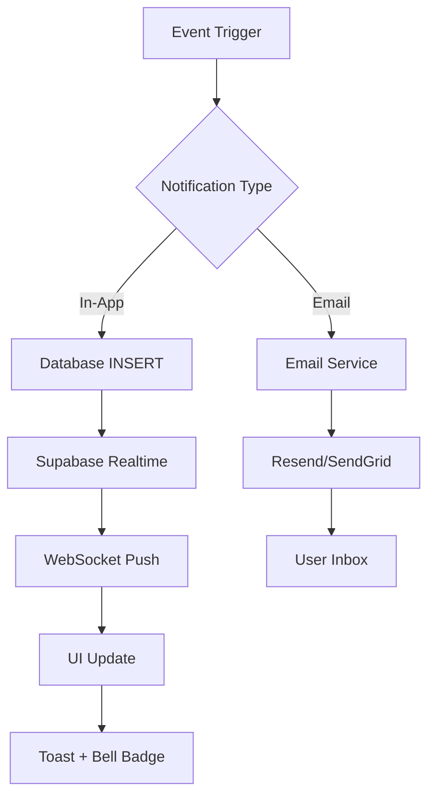

# Sistem Notificări - CampusConnect

**Autori**: Mihai Octavian & Abbasi Pazeyazd Bianca-Maria  
**Versiune**: 1.0  
**Data**: Decembrie 2024  

---

## 1. Arhitectură Sistem Notificări

### 1.1 Overview

**Două canale paralele**:
1. **In-App Notifications** - Real-time în aplicație
2. **Email Notifications** - Asincrone prin email



### 1.2 Database Schema

**Tabelă**: `notifications`

```sql
CREATE TABLE public.notifications (
  id UUID PRIMARY KEY DEFAULT gen_random_uuid(),
  user_id UUID NOT NULL REFERENCES auth.users(id) ON DELETE CASCADE,
  type TEXT NOT NULL CHECK (type IN (
    'ENROLLMENT_CONFIRMED',
    'ENROLLMENT_REJECTED',
    'ENROLLMENT_CANCELLED',
    'HOURS_APPROVED',
    'HOURS_REJECTED',
    'HOURS_INFO_REQUESTED',
    'ACTIVITY_CREATED',
    'ACTIVITY_UPDATED',
    'ACTIVITY_CANCELLED',
    'SESSION_REMINDER',
    'CERTIFICATE_READY',
    'NEW_ENROLLMENT',
    'HOURS_REQUEST'
  )),
  title TEXT NOT NULL,
  message TEXT NOT NULL,
  link TEXT,
  metadata JSONB DEFAULT '{}'::jsonb,
  is_read BOOLEAN DEFAULT false NOT NULL,
  read_at TIMESTAMPTZ,
  created_at TIMESTAMPTZ DEFAULT NOW() NOT NULL
);

CREATE INDEX idx_notifications_user_id ON public.notifications(user_id);
CREATE INDEX idx_notifications_user_id_is_read ON public.notifications(user_id, is_read);
CREATE INDEX idx_notifications_created_at ON public.notifications(created_at DESC);
```

---

## 2. Tipuri Notificări

### 2.1 Pentru Studenți

| Tip | Trigger | Prioritate | Email | In-App |
|-----|---------|-----------|-------|--------|
| `ENROLLMENT_CONFIRMED` | Înscriere aprobată | High | ✅ | ✅ |
| `ENROLLMENT_REJECTED` | Înscriere respinsă | High | ✅ | ✅ |
| `ENROLLMENT_CANCELLED` | Activitate anulată | High | ✅ | ✅ |
| `HOURS_APPROVED` | Ore validate | High | ✅ | ✅ |
| `HOURS_REJECTED` | Ore respinse | Medium | ✅ | ✅ |
| `HOURS_INFO_REQUESTED` | Info suplimentare | Medium | ✅ | ✅ |
| `SESSION_REMINDER` | Reminder sesiune | Medium | ✅ | ✅ |
| `CERTIFICATE_READY` | Certificat gata | High | ✅ | ✅ |
| `ACTIVITY_CREATED` | Activitate nouă relevantă | Low | ❌ | ✅ |

### 2.2 Pentru Profesori

| Tip | Trigger | Prioritate | Email | In-App |
|-----|---------|-----------|-------|--------|
| `NEW_ENROLLMENT` | Student înscris | High | ✅ | ✅ |
| `HOURS_REQUEST` | Cerere validare ore | High | ✅ | ✅ |
| `ACTIVITY_FULL` | Capacitate completă | Low | ❌ | ✅ |

### 2.3 Pentru Administratori

| Tip | Trigger | Prioritate | Email | In-App |
|-----|---------|-----------|-------|--------|
| `ACTIVITY_PENDING_APPROVAL` | Activitate nouă | High | ✅ | ✅ |
| `USER_REGISTERED` | User nou | Low | ❌ | ✅ |
| `REPORT_SUBMITTED` | Raport nou | Medium | ✅ | ✅ |

---

## 3. In-App Notifications

### 3.1 Hook Custom: `useNotifications`

**Locație**: `src/lib/hooks/useNotifications.ts`

**Features**:
- ✅ Fetch notifications cu paginare
- ✅ Real-time updates (Supabase Realtime)
- ✅ Mark as read
- ✅ Mark all as read
- ✅ Delete notification
- ✅ Unread count tracking

**Usage**:
```typescript
import { useNotifications } from '@/lib/hooks/useNotifications';

function NotificationPanel() {
  const {
    notifications,
    unreadCount,
    total,
    isLoading,
    error,
    refetch,
    markAsRead,
    markAllAsRead,
    deleteNotification,
    loadMore,
    hasMore,
  } = useNotifications({
    limit: 20,
    unreadOnly: false,
    enableRealtime: true,
  });

  return (
    <div>
      <h3>Notifications ({unreadCount} unread)</h3>
      {notifications.map(notif => (
        <NotificationItem
          key={notif.id}
          notification={notif}
          onMarkAsRead={markAsRead}
          onDelete={deleteNotification}
        />
      ))}
      {hasMore && (
        <button onClick={loadMore}>Load more</button>
      )}
    </div>
  );
}
```

### 3.2 Real-time Subscription

**Mechanism**: Supabase Postgres Changes

```typescript
// Subscription setup în useNotifications hook
useEffect(() => {
  const supabase = createClient();

  const channel = supabase
    .channel('notifications-changes')
    .on(
      'postgres_changes',
      {
        event: 'INSERT',
        schema: 'public',
        table: 'notifications',
      },
      (payload) => {
        const newNotification = payload.new as Notification;
        setNotifications(prev => [newNotification, ...prev]);
        setUnreadCount(prev => prev + 1);
        
        // Show toast
        toast.info(newNotification.title, {
          description: newNotification.message
        });
      }
    )
    .on(
      'postgres_changes',
      {
        event: 'UPDATE',
        schema: 'public',
        table: 'notifications',
      },
      (payload) => {
        const updated = payload.new as Notification;
        setNotifications(prev =>
          prev.map(n => n.id === updated.id ? updated : n)
        );
      }
    )
    .on(
      'postgres_changes',
      {
        event: 'DELETE',
        schema: 'public',
        table: 'notifications',
      },
      (payload) => {
        const deletedId = payload.old?.id;
        setNotifications(prev => prev.filter(n => n.id !== deletedId));
      }
    )
    .subscribe();

  return () => {
    supabase.removeChannel(channel);
  };
}, []);
```

### 3.3 Notification UI Components

**NotificationBell** (`components/notifications/NotificationBell.tsx`):
```tsx
'use client';

import { Bell } from 'lucide-react';
import { Button } from '@/components/ui/button';
import {
  Popover,
  PopoverContent,
  PopoverTrigger,
} from '@/components/ui/popover';
import { useNotifications } from '@/lib/hooks/useNotifications';

export function NotificationBell() {
  const { unreadCount } = useNotifications({ limit: 1 });

  return (
    <Popover>
      <PopoverTrigger asChild>
        <Button variant="ghost" size="icon" className="relative">
          <Bell className="h-5 w-5" />
          {unreadCount > 0 && (
            <span className="absolute -top-1 -right-1 bg-red-500 text-white text-xs rounded-full h-5 w-5 flex items-center justify-center">
              {unreadCount > 9 ? '9+' : unreadCount}
            </span>
          )}
        </Button>
      </PopoverTrigger>
      <PopoverContent className="w-96">
        <NotificationList />
      </PopoverContent>
    </Popover>
  );
}
```

**NotificationItem** (`components/notifications/NotificationItem.tsx`):
```tsx
import { formatDistanceToNow } from 'date-fns';
import { ro } from 'date-fns/locale';
import { CheckCircle, XCircle, Bell } from 'lucide-react';

const ICON_MAP = {
  ENROLLMENT_CONFIRMED: CheckCircle,
  ENROLLMENT_REJECTED: XCircle,
  HOURS_APPROVED: CheckCircle,
  // ... rest
};

export function NotificationItem({ notification, onMarkAsRead, onDelete }) {
  const Icon = ICON_MAP[notification.type] || Bell;
  
  return (
    <div className={cn(
      "p-4 border-b hover:bg-gray-50 cursor-pointer",
      !notification.is_read && "bg-blue-50"
    )}>
      <div className="flex items-start gap-3">
        <Icon className="h-5 w-5 text-blue-500" />
        <div className="flex-1">
          <p className="font-medium">{notification.title}</p>
          <p className="text-sm text-gray-600">{notification.message}</p>
          <p className="text-xs text-gray-400 mt-1">
            {formatDistanceToNow(new Date(notification.created_at), {
              addSuffix: true,
              locale: ro
            })}
          </p>
        </div>
        {!notification.is_read && (
          <Button
            variant="ghost"
            size="sm"
            onClick={() => onMarkAsRead(notification.id)}
          >
            Mark read
          </Button>
        )}
      </div>
    </div>
  );
}
```

---

## 4. Toast Notifications

### 4.1 Library: Sonner

**Installation**:
```bash
npm install sonner
```

**Setup** (`app/layout.tsx`):
```tsx
import { Toaster } from 'sonner';

export default function RootLayout({ children }) {
  return (
    <html>
      <body>
        {children}
        <Toaster 
          position="top-right" 
          richColors 
          closeButton 
        />
      </body>
    </html>
  );
}
```

### 4.2 Usage Examples

```typescript
import { toast } from 'sonner';

// Success
toast.success('Înscrierea a fost confirmată!');

// Error
toast.error('Eroare la procesare. Încearcă din nou.');

// Info
toast.info('Sesiunea începe în 1 oră');

// Warning
toast.warning('Capacitatea activității aproape completă');

// Loading
const promise = enrollStudent();
toast.promise(promise, {
  loading: 'Se procesează...',
  success: 'Success!',
  error: 'Eroare!'
});

// With action
toast('Notificare nouă', {
  description: 'Ai primit un mesaj',
  action: {
    label: 'View',
    onClick: () => console.log('Clicked')
  }
});

// With duration
toast.success('Salvat!', { duration: 2000 });

// Dismiss specific
const toastId = toast.loading('Loading...');
// Later:
toast.dismiss(toastId);

// Dismiss all
toast.dismiss();
```

### 4.3 Custom Toast Component

```tsx
toast.custom((t) => (
  <div className="bg-white rounded-lg shadow-lg p-4 flex items-start gap-3">
    <Avatar src={user.avatar} />
    <div>
      <p className="font-medium">{user.name} te-a marcat</p>
      <p className="text-sm text-gray-600">în activitatea "STEM Mentorship"</p>
    </div>
    <Button size="sm" onClick={() => toast.dismiss(t)}>
      Vezi
    </Button>
  </div>
));
```

---

## 5. Notification Service

### 5.1 Send Notification Function

**Locație**: `src/lib/services/email-notifications.ts`

```typescript
interface NotificationPayload {
  userId: string;
  type: NotificationType;
  title: string;
  message: string;
  link?: string;
  metadata?: Record<string, unknown>;
}

export async function sendNotification(
  payload: NotificationPayload
): Promise<boolean> {
  try {
    const supabase = await createClient();

    const { error } = await supabase.from('notifications').insert({
      user_id: payload.userId,
      type: payload.type,
      title: payload.title,
      message: payload.message,
      link: payload.link,
      metadata: payload.metadata,
      is_read: false,
    });

    if (error) {
      console.error('Error sending notification:', error);
      return false;
    }

    return true;
  } catch (error) {
    console.error('Error in sendNotification:', error);
    return false;
  }
}
```

### 5.2 Usage în API Routes

**Example**: Enrollment confirmation

```typescript
// app/api/enrollments/[id]/approve/route.ts
import { sendNotification } from '@/lib/services/email-notifications';

export async function POST(req: Request) {
  // ... approve enrollment logic
  
  // Send in-app notification
  await sendNotification({
    userId: enrollment.student_id,
    type: 'ENROLLMENT_CONFIRMED',
    title: 'Înscriere confirmată!',
    message: `Înscrierea ta la "${activity.title}" a fost aprobată.`,
    link: `/opportunities/${activity.id}`,
    metadata: {
      activity_id: activity.id,
      enrollment_id: enrollment.id,
    },
  });
  
  // Send email (parallel)
  await sendEmail('ENROLLMENT_CONFIRMED', {
    email: student.email,
    studentName: student.first_name,
    activityTitle: activity.title,
    startDate: format(activity.start_date, 'dd MMMM yyyy'),
    location: activity.location,
    link: `${process.env.NEXT_PUBLIC_APP_URL}/opportunities/${activity.id}`,
  });
  
  return NextResponse.json({ success: true });
}
```

---

## 6. Notification Preferences

### 6.1 User Settings

**Tabelă**: `profiles.notification_preferences` (JSONB)

```json
{
  "email_enabled": true,
  "in_app_enabled": true,
  "enrollment_confirmed": true,
  "enrollment_rejected": true,
  "hours_approved": true,
  "hours_rejected": false,
  "session_reminder": true,
  "activity_updates": false,
  "marketing_emails": false
}
```

### 6.2 Settings UI

```tsx
// app/dashboard/settings/notifications/page.tsx
export default function NotificationSettings() {
  const [prefs, setPrefs] = useState(defaultPrefs);

  const updatePref = async (key: string, value: boolean) => {
    setPrefs(prev => ({ ...prev, [key]: value }));
    
    // Update in database
    await fetch('/api/user/preferences', {
      method: 'PATCH',
      body: JSON.stringify({ notification_preferences: { [key]: value } })
    });
  };

  return (
    <div className="space-y-4">
      <h2>Notification Preferences</h2>
      
      <div className="space-y-2">
        <div className="flex items-center justify-between">
          <div>
            <p className="font-medium">Email Notifications</p>
            <p className="text-sm text-gray-600">Primește notificări prin email</p>
          </div>
          <Switch
            checked={prefs.email_enabled}
            onCheckedChange={(v) => updatePref('email_enabled', v)}
          />
        </div>
        
        <div className="flex items-center justify-between">
          <div>
            <p className="font-medium">Enrollment Confirmations</p>
            <p className="text-sm text-gray-600">Când înscrierea este aprobată</p>
          </div>
          <Switch
            checked={prefs.enrollment_confirmed}
            onCheckedChange={(v) => updatePref('enrollment_confirmed', v)}
          />
        </div>
        
        {/* ... more settings */}
      </div>
    </div>
  );
}
```

### 6.3 Check Preferences Before Sending

```typescript
async function sendNotificationWithPreferences(
  userId: string,
  type: NotificationType,
  payload: NotificationPayload
) {
  // Get user preferences
  const { data: profile } = await supabase
    .from('profiles')
    .select('notification_preferences')
    .eq('id', userId)
    .single();
  
  const prefs = profile?.notification_preferences || {};
  
  // Check if this type is enabled
  const prefKey = type.toLowerCase();
  if (prefs[prefKey] === false) {
    console.log(`Notification ${type} disabled for user ${userId}`);
    return;
  }
  
  // Send in-app if enabled
  if (prefs.in_app_enabled !== false) {
    await sendNotification(payload);
  }
  
  // Send email if enabled
  if (prefs.email_enabled !== false) {
    await sendEmail(type, { ...payload, email: profile.email });
  }
}
```

---

## 7. Best Practices

### 7.1 Când să trimiți notificări

✅ **Do**:
- Events importante (approval, rejection)
- Deadlines și reminders
- Status changes
- User-triggered actions complete

❌ **Don't**:
- Prea multe notificări (spam)
- Info redundantă (user știe deja)
- Marketing fără consent

### 7.2 Content Guidelines

**Title**: Scurt, sub 50 caractere
```
✅ "Înscriere confirmată!"
❌ "Bună! Avem vești bune pentru tine despre activitatea la care te-ai înscris"
```

**Message**: Descriptiv, sub 150 caractere
```
✅ "Înscrierea ta la STEM Mentorship a fost aprobată. Vezi detalii în dashboard."
❌ "Salut! Vrem să te informăm că profesorul a aprobat înscrierea ta la una dintre activități."
```

**Link**: Direct către resursa relevantă
```
✅ /opportunities/abc123
❌ /dashboard (generic)
```

### 7.3 Performance

**Batching**: Pentru notificări bulk (ex: anulare activitate cu 50 studenți)
```typescript
// BAD: 50 individual INSERTs
for (const student of students) {
  await sendNotification({ userId: student.id, ... });
}

// GOOD: 1 bulk INSERT
const notifications = students.map(s => ({
  user_id: s.id,
  type: 'ACTIVITY_CANCELLED',
  // ...
}));
await supabase.from('notifications').insert(notifications);
```

**Rate Limiting**: Max 10 notificări/minut/user
```typescript
const rateLimitKey = `notif_rate:${userId}`;
const count = await redis.incr(rateLimitKey);
if (count === 1) {
  await redis.expire(rateLimitKey, 60);
}
if (count > 10) {
  console.log('Rate limit exceeded');
  return;
}
```

---

## 8. Testing

### 8.1 Manual Testing

**Trigger notification**:
```typescript
// Test script: scripts/test-notification.ts
import { sendNotification } from '@/lib/services/email-notifications';

await sendNotification({
  userId: 'user-uuid-here',
  type: 'ENROLLMENT_CONFIRMED',
  title: 'Test Notification',
  message: 'This is a test',
  link: '/dashboard',
});

console.log('Notification sent! Check UI and database');
```

**Run**:
```bash
npx tsx scripts/test-notification.ts
```

### 8.2 E2E Testing

```typescript
// tests/notifications.spec.ts
import { test, expect } from '@playwright/test';

test('should show notification bell badge', async ({ page }) => {
  await page.goto('/dashboard');
  
  // Trigger notification (via API or real action)
  await page.click('[data-testid="enroll-button"]');
  
  // Wait for real-time update
  await page.waitForTimeout(1000);
  
  // Check bell badge
  const badge = page.locator('[data-testid="notification-badge"]');
  await expect(badge).toHaveText('1');
});

test('should mark notification as read', async ({ page }) => {
  await page.goto('/dashboard');
  
  // Open notifications
  await page.click('[data-testid="notification-bell"]');
  
  // Click notification
  await page.click('[data-testid="notification-item"]:first-child');
  
  // Check badge updated
  const badge = page.locator('[data-testid="notification-badge"]');
  await expect(badge).toHaveText('0');
});
```

---

**Document creat de**: Mihai Octavian & Abbasi Pazeyazd Bianca-Maria  
**Ultima actualizare**: Decembrie 2024  
**Versiune**: 1.0
