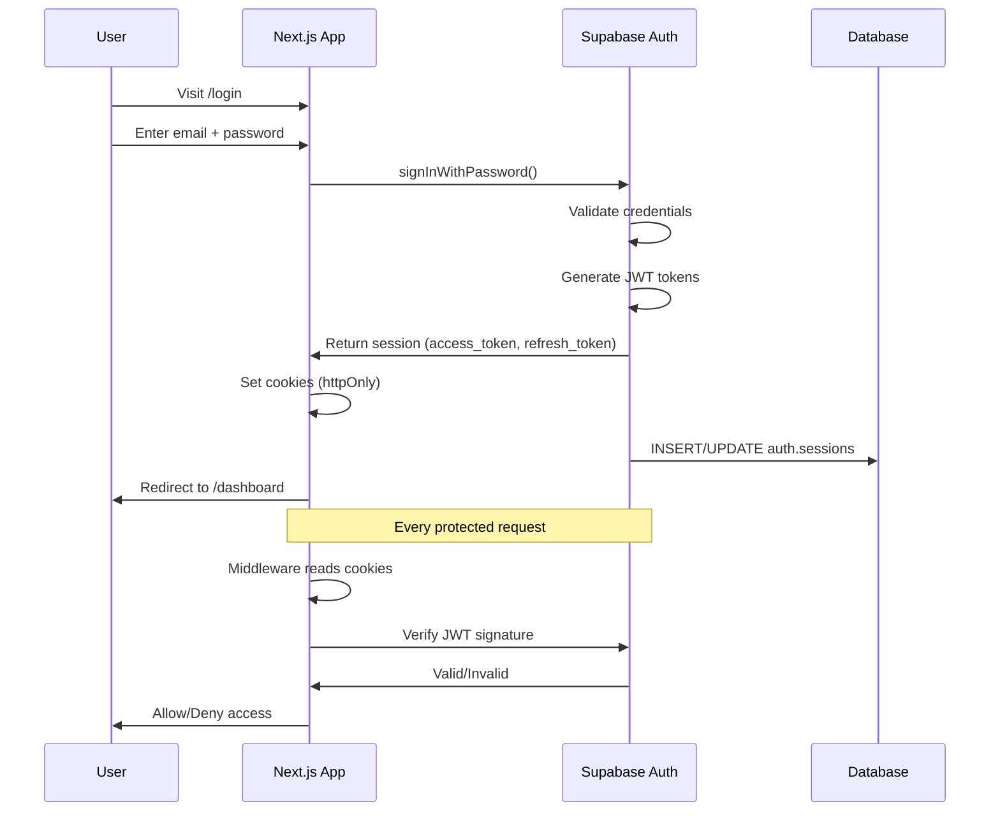

# Autentificare - CampusConnect

**Autori**: Mihai Octavian & Abbasi Pazeyazd Bianca-Maria  
**Versiune**: 1.0  
**Data**: Decembrie 2024  

---

## 1. Supabase Auth - Overview

### 1.1 Provider

**Supabase Authentication** (built on PostgreSQL + GoTrue)

**Features active**:
- ✅ Email + Password sign up/in
- ✅ Magic links (email passwordless)
- ✅ JWT tokens (access + refresh)
- ✅ Email verification
- ✅ Password reset
- ✅ Session management
- ❌ OAuth providers (Google, GitHub) - planned

### 1.2 Auth Flow Diagram



---

## 2. Sign Up Flow

### 2.1 Registration Page

**Locație**: `app/(auth)/sign-up/page.tsx`

**Form Fields**:
- First Name (required)
- Last Name (required)
- Email universitar (required, validare domeniu)
- Password (required, min 8 caractere)

**Validation**:
```typescript
const signUpSchema = z.object({
  firstName: z.string().min(2, 'Minim 2 caractere'),
  lastName: z.string().min(2, 'Minim 2 caractere'),
  email: z.string().email('Email invalid').refine(
    (email) => email.endsWith('@univ.ro'),
    'Doar emailuri universitare (@univ.ro)'
  ),
  password: z.string()
    .min(8, 'Minim 8 caractere')
    .regex(/[A-Z]/, 'Minim o literă mare')
    .regex(/[0-9]/, 'Minim o cifră'),
});
```

### 2.2 Server Action

```typescript
// app/(auth)/sign-up/actions.ts
'use server';

import { createClient } from '@/lib/supabase/server';
import { redirect } from 'next/navigation';

export async function signUp(formData: FormData) {
  const supabase = await createClient();
  
  const email = formData.get('email') as string;
  const password = formData.get('password') as string;
  const firstName = formData.get('firstName') as string;
  const lastName = formData.get('lastName') as string;
  
  // Sign up with Supabase Auth
  const { data, error } = await supabase.auth.signUp({
    email,
    password,
    options: {
      data: {
        first_name: firstName,
        last_name: lastName,
      },
    },
  });
  
  if (error) {
    return { error: error.message };
  }
  
  // Create profile (triggered by database trigger)
  // See: supabase/migrations/00000_create_profiles_table.sql
  
  redirect('/auth/verify-email');
}
```

### 2.3 Email Verification

**Flow**:
1. User sign up → Supabase trimite email verificare
2. User click link → Token validat
3. Redirect către `/auth/callback` → Session creată
4. Redirect către `/dashboard`

**Email Template** (Supabase Dashboard):
```
Subject: Verifică emailul - Campus Connect

Bună {{.Name}}!

Bine ai venit pe Campus Connect! Te rugăm să îți verifici emailul click-ind pe link-ul de mai jos:

{{.ConfirmationURL}}

Dacă nu ai creat acest cont, ignoră acest email.

Cu drag,
Echipa Campus Connect
```

---

## 3. Sign In Flow

### 3.1 Login Page

**Locație**: `app/(auth)/login/page.tsx`

**Options**:
- Email + Password
- Magic Link (passwordless)

### 3.2 Email + Password Login

```typescript
// app/(auth)/login/actions.ts
'use server';

export async function signIn(formData: FormData) {
  const supabase = await createClient();
  
  const email = formData.get('email') as string;
  const password = formData.get('password') as string;
  
  const { data, error } = await supabase.auth.signInWithPassword({
    email,
    password,
  });
  
  if (error) {
    return { error: error.message };
  }
  
  redirect('/dashboard');
}
```

### 3.3 Magic Link Login

```typescript
export async function signInWithMagicLink(email: string) {
  const supabase = await createClient();
  
  const { error } = await supabase.auth.signInWithOtp({
    email,
    options: {
      emailRedirectTo: `${process.env.NEXT_PUBLIC_APP_URL}/auth/callback`,
    },
  });
  
  if (error) {
    return { error: error.message };
  }
  
  return { success: true };
}
```

---

## 4. Session Management

### 4.1 JWT Tokens

**Access Token**:
- Lifetime: 1 hour (default)
- Contains: `user_id`, `email`, `role`, `aud`, `exp`
- Stored: HTTP-only cookie (`sb-access-token`)

**Refresh Token**:
- Lifetime: 30 days (default)
- Stored: HTTP-only cookie (`sb-refresh-token`)
- Used pentru: Regenerate access token

### 4.2 Token Structure

```json
{
  "aud": "authenticated",
  "exp": 1704124800,
  "iat": 1704121200,
  "sub": "user-uuid",
  "email": "ana.popescu@univ.ro",
  "role": "authenticated",
  "app_metadata": {
    "provider": "email",
    "providers": ["email"]
  },
  "user_metadata": {
    "first_name": "Ana",
    "last_name": "Popescu"
  }
}
```

### 4.3 Token Refresh

**Automatic**: Supabase client auto-refreshează token când expiră

```typescript
// Middleware checks and refreshes
export async function middleware(request: NextRequest) {
  const { supabase, response } = createClient(request);
  
  // Refresh session if expired
  const { data: { session } } = await supabase.auth.getSession();
  
  if (!session) {
    return NextResponse.redirect(new URL('/login', request.url));
  }
  
  return response;
}
```

---

## 5. Middleware Protection

### 5.1 Route Protection

**Locație**: `middleware.ts`

```typescript
import { createServerClient } from '@supabase/ssr';
import { NextResponse, type NextRequest } from 'next/server';

export async function middleware(request: NextRequest) {
  let response = NextResponse.next();
  
  const supabase = createServerClient(
    process.env.NEXT_PUBLIC_SUPABASE_URL!,
    process.env.NEXT_PUBLIC_SUPABASE_ANON_KEY!,
    {
      cookies: {
        get: (name) => request.cookies.get(name)?.value,
        set: (name, value, options) => {
          response.cookies.set({ name, value, ...options });
        },
        remove: (name, options) => {
          response.cookies.delete({ name, ...options });
        },
      },
    }
  );
  
  const { data: { session } } = await supabase.auth.getSession();
  
  // Protected routes
  if (request.nextUrl.pathname.startsWith('/dashboard')) {
    if (!session) {
      return NextResponse.redirect(new URL('/login', request.url));
    }
  }
  
  // Auth routes (redirect if logged in)
  if (['/login', '/sign-up'].includes(request.nextUrl.pathname)) {
    if (session) {
      return NextResponse.redirect(new URL('/dashboard', request.url));
    }
  }
  
  return response;
}

export const config = {
  matcher: [
    '/dashboard/:path*',
    '/login',
    '/sign-up',
  ],
};
```

### 5.2 Role-Based Access

```typescript
// Example: Professor-only page
export async function middleware(request: NextRequest) {
  // ... get session
  
  if (request.nextUrl.pathname.startsWith('/dashboard/professor')) {
    const { data: profile } = await supabase
      .from('profiles')
      .select('role')
      .eq('id', session.user.id)
      .single();
    
    if (profile?.role !== 'PROFESSOR') {
      return NextResponse.redirect(new URL('/dashboard', request.url));
    }
  }
  
  return response;
}
```

---

## 6. Server-Side Auth

### 6.1 Server Components

```typescript
// app/dashboard/page.tsx
import { createClient } from '@/lib/supabase/server';
import { redirect } from 'next/navigation';

export default async function DashboardPage() {
  const supabase = await createClient();
  
  const { data: { session } } = await supabase.auth.getSession();
  
  if (!session) {
    redirect('/login');
  }
  
  // Fetch user profile
  const { data: profile } = await supabase
    .from('profiles')
    .select('*')
    .eq('id', session.user.id)
    .single();
  
  return (
    <div>
      <h1>Welcome, {profile.first_name}!</h1>
    </div>
  );
}
```

### 6.2 Server Actions

```typescript
// app/actions/profile.ts
'use server';

import { createClient } from '@/lib/supabase/server';

export async function updateProfile(formData: FormData) {
  const supabase = await createClient();
  
  // Get current user
  const { data: { session } } = await supabase.auth.getSession();
  
  if (!session) {
    throw new Error('Not authenticated');
  }
  
  const { error } = await supabase
    .from('profiles')
    .update({
      first_name: formData.get('firstName'),
      last_name: formData.get('lastName'),
    })
    .eq('id', session.user.id);
  
  if (error) throw error;
  
  return { success: true };
}
```

---

## 7. Client-Side Auth

### 7.1 useUser Hook

```typescript
// lib/hooks/useUser.ts
'use client';

import { createClient } from '@/lib/supabase/client';
import { useEffect, useState } from 'react';
import type { User } from '@supabase/supabase-js';

export function useUser() {
  const [user, setUser] = useState<User | null>(null);
  const [loading, setLoading] = useState(true);
  
  useEffect(() => {
    const supabase = createClient();
    
    // Get initial session
    supabase.auth.getSession().then(({ data: { session } }) => {
      setUser(session?.user ?? null);
      setLoading(false);
    });
    
    // Listen for auth changes
    const { data: { subscription } } = supabase.auth.onAuthStateChange(
      (_event, session) => {
        setUser(session?.user ?? null);
      }
    );
    
    return () => subscription.unsubscribe();
  }, []);
  
  return { user, loading };
}
```

**Usage**:
```tsx
'use client';

import { useUser } from '@/lib/hooks/useUser';

export function ProfileButton() {
  const { user, loading } = useUser();
  
  if (loading) return <Skeleton />;
  if (!user) return <LoginButton />;
  
  return <UserMenu user={user} />;
}
```

---

## 8. Password Reset

### 8.1 Request Reset

```typescript
// app/(auth)/forgot-password/actions.ts
'use server';

export async function requestPasswordReset(email: string) {
  const supabase = await createClient();
  
  const { error } = await supabase.auth.resetPasswordForEmail(email, {
    redirectTo: `${process.env.NEXT_PUBLIC_APP_URL}/auth/reset-password`,
  });
  
  if (error) {
    return { error: error.message };
  }
  
  return { success: true };
}
```

### 8.2 Reset Password

```typescript
// app/(auth)/reset-password/actions.ts
'use server';

export async function resetPassword(newPassword: string) {
  const supabase = await createClient();
  
  const { error } = await supabase.auth.updateUser({
    password: newPassword,
  });
  
  if (error) {
    return { error: error.message };
  }
  
  redirect('/login');
}
```

---

## 9. Logout

```typescript
'use server';

import { createClient } from '@/lib/supabase/server';
import { redirect } from 'next/navigation';

export async function signOut() {
  const supabase = await createClient();
  
  await supabase.auth.signOut();
  
  redirect('/login');
}
```

**Usage**:
```tsx
'use client';

import { signOut } from '@/app/actions/auth';

export function LogoutButton() {
  return (
    <button onClick={() => signOut()}>
      Logout
    </button>
  );
}
```

---

## 10. Security Best Practices

### 10.1 Password Requirements

✅ **Enforced**:
- Min 8 characters
- Min 1 uppercase
- Min 1 number

✅ **Recommended** (add):
- Min 1 special character
- Max length (e.g., 128)
- Common password check (list of 10k most common)

### 10.2 Session Security

✅ **Active**:
- HTTP-only cookies (XSS protection)
- Secure flag (HTTPS only)
- SameSite=Lax (CSRF protection)
- Auto token refresh

### 10.3 Rate Limiting

**Supabase Auth** (built-in):
- 30 requests / hour / IP for sign up
- 30 requests / hour / IP for password reset

**Custom** (add Redis):
```typescript
import { Ratelimit } from '@upstash/ratelimit';
import { Redis } from '@upstash/redis';

const ratelimit = new Ratelimit({
  redis: Redis.fromEnv(),
  limiter: Ratelimit.slidingWindow(5, '15 m'), // 5 requests per 15 min
  prefix: 'ratelimit:login',
});

export async function signIn(formData: FormData) {
  const email = formData.get('email') as string;
  
  const { success } = await ratelimit.limit(email);
  
  if (!success) {
    return { error: 'Prea multe încercări. Încearcă în 15 minute.' };
  }
  
  // ... rest of login
}
```

---

**Document creat de**: Mihai Octavian & Abbasi Pazeyazd Bianca-Maria  
**Ultima actualizare**: Decembrie 2024  
**Versiune**: 1.0
