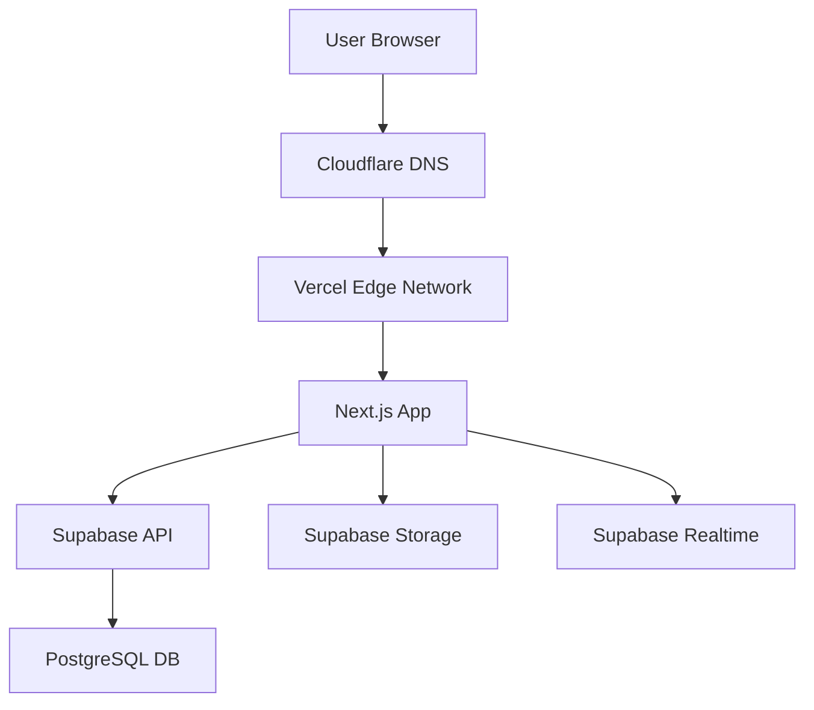

# Ghid Deployment - CampusConnect

**Autori**: Mihai Octavian & Abbasi Pazeyazd Bianca-Maria  
**Versiune**: 1.0  
**Data**: Decembrie 2024  

---

## 1. Stack Deployment

### 1.1 Componentele Infrastructurii

| Component | Provider | Purpose | Cost |
|-----------|----------|---------|------|
| **Frontend** | Vercel | Next.js hosting, CDN, Edge Functions | Free tier |
| **Database** | Supabase | PostgreSQL 15, Auth, Storage, Realtime | Free tier (500MB) |
| **DNS** | Cloudflare | Domain management, DDoS protection | Free |
| **Monitoring** | Vercel Analytics + Sentry | Performance + Error tracking | Free tiers |



---

## 2. Vercel Deployment

### 2.1 Setup Inițial

**Pas 1**: Connect GitHub Repository
```bash
# Link la dashboard Vercel
https://vercel.com/new
```

**Pas 2**: Configure Project
```yaml
# vercel.json
{
  "buildCommand": "npm run build",
  "devCommand": "npm run dev",
  "installCommand": "npm install",
  "framework": "nextjs",
  "regions": ["fra1"]  # Frankfurt (EU)
}
```

**Pas 3**: Environment Variables (Vercel Dashboard)
```bash
NEXT_PUBLIC_SUPABASE_URL=https://xxx.supabase.co
NEXT_PUBLIC_SUPABASE_ANON_KEY=eyJhbGc...
SUPABASE_SERVICE_ROLE_KEY=eyJhbGc... # Secret!
NEXT_PUBLIC_APP_URL=https://campus-connect.vercel.app
```

### 2.2 Build Configuration

**next.config.js**:
```javascript
/** @type {import('next').NextConfig} */
const nextConfig = {
  images: {
    remotePatterns: [
      {
        protocol: 'https',
        hostname: '*.supabase.co',
        pathname: '/storage/v1/object/public/**',
      },
    ],
  },
  // Vercel Analytics
  experimental: {
    serverActions: true,
  },
};

module.exports = nextConfig;
```

### 2.3 Deployment Workflow

**Automatic Deployments**:
- **Production**: `main` branch → https://campus-connect.vercel.app
- **Preview**: All PRs → unique URL (ex: `pr-42-campus-connect.vercel.app`)

**Manual Deploy**:
```bash
npm install -g vercel
vercel --prod  # Deploy to production
```

---

## 3. Supabase Setup

### 3.1 Project Creation

1. Visit [supabase.com/dashboard](https://supabase.com/dashboard)
2. Create new project: "campus-connect-prod"
3. Select region: **Europe (Frankfurt)** pentru latență mică
4. Set database password (SIGUR!)

### 3.2 Database Migrations

**Local Development**:
```bash
# Install Supabase CLI
npm install -g supabase

# Link to project
supabase link --project-ref your-project-ref

# Run migrations
supabase db push
```

**Migration Files** (`supabase/migrations/*.sql`):
```
00000_initial_schema.sql
00001_create_profiles_table.sql
00002_create_activities_table.sql
00003_create_enrollments_table.sql
...
```

**Deploy Migrations**:
```bash
# Apply all pending migrations
supabase db push

# Or via Dashboard: Database → Migrations → Run
```

### 3.3 Storage Buckets

**Create Buckets**:
1. Storage → New bucket
2. Name: `activity-images` (public)
3. Enable RLS policies

**RLS Policy**:
```sql
-- Anyone can read public images
CREATE POLICY "Public images are viewable by all"
ON storage.objects FOR SELECT
USING (bucket_id = 'activity-images');

-- Authenticated users can upload
CREATE POLICY "Authenticated users can upload images"
ON storage.objects FOR INSERT
WITH CHECK (
  bucket_id = 'activity-images' AND
  auth.role() = 'authenticated'
);
```

---

## 4. Environment Configuration

### 4.1 `.env.local` (Development)

```bash
# Supabase
NEXT_PUBLIC_SUPABASE_URL=http://localhost:54321
NEXT_PUBLIC_SUPABASE_ANON_KEY=eyJhbGciOiJIUzI1NiIs...
SUPABASE_SERVICE_ROLE_KEY=eyJhbGciOiJIUzI1NiIs...

# App
NEXT_PUBLIC_APP_URL=http://localhost:3000

# Sentry (optional)
SENTRY_DSN=https://xxx@sentry.io/xxx
```

### 4.2 Vercel Environment Variables

**Add în Vercel Dashboard** → Settings → Environment Variables:

| Key | Value | Environments |
|-----|-------|--------------|
| `NEXT_PUBLIC_SUPABASE_URL` | `https://xxx.supabase.co` | Production, Preview |
| `NEXT_PUBLIC_SUPABASE_ANON_KEY` | `eyJ...` | Production, Preview |
| `SUPABASE_SERVICE_ROLE_KEY` | `eyJ...` (secret) | Production only |
| `NEXT_PUBLIC_APP_URL` | `https://campus-connect.vercel.app` | Production |
| | `https://$VERCEL_URL` | Preview |

---

## 5. CI/CD Pipeline

### 5.1 GitHub Actions (Optional)

**`.github/workflows/ci.yml`**:
```yaml
name: CI

on:
  pull_request:
    branches: [main, develop]

jobs:
  lint:
    runs-on: ubuntu-latest
    steps:
      - uses: actions/checkout@v3
      - uses: actions/setup-node@v3
        with:
          node-version: '18'
      - run: npm ci
      - run: npm run lint
  
  typecheck:
    runs-on: ubuntu-latest
    steps:
      - uses: actions/checkout@v3
      - uses: actions/setup-node@v3
      - run: npm ci
      - run: npm run typecheck
  
  test:
    runs-on: ubuntu-latest
    steps:
      - uses: actions/checkout@v3
      - uses: actions/setup-node@v3
      - run: npm ci
      - run: npm run test
```

### 5.2 Vercel Integration

Vercel auto-runs:
- ✅ Build checks
- ✅ Lighthouse audits
- ✅ Comment pe PR cu preview URL

---

## 6. Database Backups

### 6.1 Supabase Automatic Backups

**Free Plan**: Daily backups (7 days retention)  
**Pro Plan**: Daily backups (30 days retention) + Point-in-time recovery

**Restore**:
```bash
# Via Dashboard: Database → Backups → Restore
```

### 6.2 Manual Backup

```bash
# Export database schema + data
pg_dump -h db.xxx.supabase.co -U postgres -d postgres > backup.sql

# Restore
psql -h db.xxx.supabase.co -U postgres -d postgres < backup.sql
```

---

## 7. Monitoring & Alerts

### 7.1 Vercel Analytics

**Built-in Metrics**:
- Page views
- Unique visitors
- Core Web Vitals (LCP, FID, CLS)
- API routes performance

**Access**: Vercel Dashboard → Analytics

### 7.2 Sentry Error Tracking

**Setup**:
```bash
npm install @sentry/nextjs
npx @sentry/wizard@latest -i nextjs
```

**`sentry.client.config.ts`**:
```typescript
import * as Sentry from '@sentry/nextjs';

Sentry.init({
  dsn: process.env.SENTRY_DSN,
  tracesSampleRate: 0.1, // 10% transactions
  environment: process.env.NODE_ENV,
});
```

### 7.3 Supabase Logs

**Via Dashboard**: Logs Explorer → Filter by:
- API requests
- Database queries
- Edge Function executions
- Auth events

---

## 8. Custom Domain

### 8.1 Cloudflare Setup

**Pas 1**: Add domain la Cloudflare
```
Domain: campusconnect.ro
Nameservers: 
  - austin.ns.cloudflare.com
  - brenda.ns.cloudflare.com
```

**Pas 2**: Configure DNS
```
Type: CNAME
Name: @
Content: cname.vercel-dns.com
Proxy: Enabled (orange cloud)
```

### 8.2 Vercel Domain

**Pas 3**: Add domain în Vercel
```
Settings → Domains → Add Domain
Domain: campusconnect.ro
```

**Pas 4**: SSL Certificate (automatic via Vercel)
```
Status: Active ✅
Certificate: Let's Encrypt
Expires: Auto-renewed
```

---

## 9. Rollback Strategy

### 9.1 Vercel Rollback

**Instant Rollback**:
```
Vercel Dashboard → Deployments → Previous deployment → Promote
```

**Via CLI**:
```bash
vercel rollback [deployment-url]
```

### 9.2 Database Rollback

**Option 1**: Restore from backup
```
Dashboard → Database → Backups → Restore to [date]
```

**Option 2**: Revert migration
```bash
# Create revert migration
supabase migration new revert_xxx

# Add DROP statements
DROP TABLE IF EXISTS new_table;
ALTER TABLE old_table ...;

# Apply
supabase db push
```

---

## 10. Deployment Checklist

### 10.1 Pre-Deployment

- [ ] Run all tests locally: `npm test`
- [ ] Check TypeScript: `npm run typecheck`
- [ ] Lint code: `npm run lint`
- [ ] Test build: `npm run build`
- [ ] Review environment variables
- [ ] Backup database
- [ ] Test on staging environment

### 10.2 Post-Deployment

- [ ] Verify homepage loads
- [ ] Test authentication (login/signup)
- [ ] Check critical user flows (enroll, create activity)
- [ ] Monitor Sentry for new errors
- [ ] Check Vercel Analytics for traffic
- [ ] Verify database connections
- [ ] Test email notifications
- [ ] Check mobile responsiveness

---

**Document creat de**: Mihai Octavian & Abbasi Pazeyazd Bianca-Maria  
**Ultima actualizare**: Decembrie 2024  
**Versiune**: 1.0
